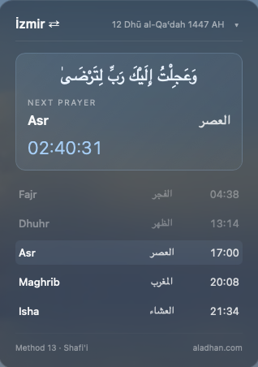
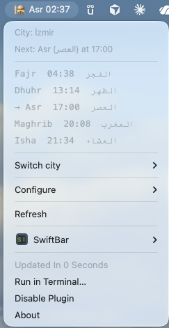

# salah-bar — Islamic Prayer Times for macOS

Live Islamic prayer times with a real-time countdown to the next prayer.
Two surfaces kept in sync:

- 🖥 **Desktop widget** (Übersicht) — glassy panel with full schedule, live seconds countdown, drag-to-move, click-to-cycle city, click-to-collapse.
- 🕌 **Menu bar** (SwiftBar) — `🕌 Fajr 02:34` countdown, click to expand the full schedule and access settings.

Times from [aladhan.com](https://aladhan.com) (no API key required).

---

## Quick install

```bash
git clone https://github.com/Abdalmoamen95/salah-bar.git
cd salah-bar
./install.sh
```

The installer:

1. Installs [Übersicht](https://tracesof.net/uebersicht/) if missing.
2. Symlinks `prayertimes.widget/` into Übersicht's widgets folder.
3. Installs [SwiftBar](https://swiftbar.app) if missing.
4. Points SwiftBar at this repo's `menubar/` folder.
5. Creates `~/.config/salah-bar/config.json` if not present.
6. Clears macOS quarantine flags on runtime folders.
7. Validates plugin execution before launch.
8. Launches both apps.

---

## Features

### Widget (Übersicht)

- Full daily prayer schedule with times.
- Live countdown to next prayer updating every second.
- Hijri date with moon phase emoji in the header (🌒 3 Dhul-Hijjah 1447 AH).
- Ayah displayed at prayer time for 2 minutes.
- Green flash alert when a prayer is approaching (configurable window).
- Rotating footer quote — Quran ayah or Sahih hadith in Arabic + English, changes every 30 minutes.
- Drag to reposition; click city name to cycle cities; click ▾/▸ to collapse.
- Prayer names shown as `{language} / {Arabic}` (e.g. `Fajr / الفجر` or `Sabah / الفجر`).

### Menu bar (SwiftBar)

- Countdown in the menu bar: `🕌 Dhuhr 01:22`.
- Green flash colour when prayer is approaching.
- Full schedule in dropdown with prayer names in `{language} / {Arabic}` format.
- Notifications at configurable offsets before prayer time (e.g. 10 min, 5 min, at time).

### Configure menu

Open the menu bar icon → **Configure**:

| Item | What it does |
|------|--------------|
| Choose default city | Pick from your saved cities |
| Add preset city (Turkey/Egypt/Qatar) | Search bundled GeoNames city list |
| Add custom city | Enter lat/lon/timezone manually |
| Toggle notifications ✓ | Enable or disable prayer alerts |
| Toggle green flash ✓ | Enable or disable the approach alert |
| Green flash window (N min) | Set the alert window: 1/3/5/10/15 min |
| Language (English/Turkish) | Switch prayer name language |
| Reset to defaults | Restore factory config |
| Open config file | Open JSON in your default editor |

---

## Configuration

All settings live in one file:

```
~/.config/salah-bar/config.json
```

Both surfaces read from it. It refreshes every 30 seconds.

### Full example

```json
{
  "default_city": "izmir",
  "method": 13,
  "school": 0,
  "language": "en",
  "flash_warning": {
    "enabled": true,
    "minutes": 5
  },
  "notifications": {
    "enabled": true,
    "offsets_minutes": [10, 5, 0]
  },
  "cities": {
    "izmir": {
      "label": "İzmir",
      "lat": 38.4192,
      "lon": 27.1287,
      "tz": "Europe/Istanbul"
    },
    "doha": {
      "label": "Doha",
      "lat": 25.2854,
      "lon": 51.5310,
      "tz": "Asia/Qatar"
    }
  }
}
```

### Keys

| Key | Type | Description |
|-----|------|-------------|
| `default_city` | string | Key from `cities` to show on startup |
| `method` | int | Calculation method (see table below) |
| `school` | `0` or `1` | `0` = Shafi'i (default), `1` = Hanafi |
| `language` | `"en"` or `"tr"` | Prayer name language. Arabic always shown alongside. |
| `flash_warning.enabled` | bool | Enable green flash when prayer is approaching |
| `flash_warning.minutes` | int | How many minutes before prayer to start flashing |
| `notifications.enabled` | bool | Enable macOS notifications |
| `notifications.offsets_minutes` | array | Minutes before prayer to notify; `0` = at prayer time |

### Language

| Value | Prayer names shown |
|-------|--------------------|
| `"en"` | Fajr / الفجر · Dhuhr / الظهر · Asr / العصر · Maghrib / المغرب · Isha / العشاء |
| `"tr"` | Sabah / الفجر · Öğle / الظهر · İkindi / العصر · Akşam / المغرب · Yatsı / العشاء |

### Calculation method

| Method | Authority | Region |
|--------|-----------|--------|
| 1 | University of Islamic Sciences, Karachi | Pakistan, Bangladesh, India |
| 2 | Islamic Society of North America (ISNA) | USA, Canada |
| 3 | Muslim World League (MWL) | Europe, Far East |
| 4 | Umm Al-Qura University, Makkah | Saudi Arabia |
| 5 | Egyptian General Authority of Survey | Egypt |
| 7 | Institute of Geophysics, University of Tehran | Iran |
| 8 | Gulf Region | Gulf states |
| 9 | Kuwait | Kuwait |
| 10 | Qatar | Qatar |
| 11 | Majlis Ugama Islam Singapura (MUIS) | Singapore |
| 12 | Union Organization Islamic de France | France |
| 13 | Diyanet İşleri Başkanlığı *(default)* | Turkey |
| 14 | Spiritual Administration of Muslims of Russia | Russia |
| 15 | Moonsighting Committee Worldwide | UK & worldwide |

---

## Widget controls

| Action | Result |
|--------|--------|
| Drag the header | Reposition the widget |
| Click city name | Cycle to next configured city |
| Click ▾ / ▸ | Toggle collapsed / expanded view |

---

## File structure

```
.
├── prayertimes.widget/
│   └── index.jsx               # Übersicht widget
├── menubar/
│   └── prayertimes.30s.py      # SwiftBar plugin (refreshes every 30s)
├── support/
│   └── configure.py            # Config helper invoked by menu items
├── config.example.json         # Copied to ~/.config/salah-bar/config.json on install
├── preset-cities.json          # Bundled presets for Turkey, Egypt, Qatar
├── install.sh
└── README.md
```

Shared state:
- **City selection**: `~/.prayertimes_city`
- **Config**: `~/.config/salah-bar/config.json`
- **API cache**: `~/Library/Caches/prayertimes/`
- **Notification state**: `~/Library/Caches/prayertimes/notify_state.json`

---

## Troubleshooting

**Widget doesn't appear.**
Make sure Übersicht is running:
```bash
pgrep -fl Übersicht
```
If clicks pass through to the desktop, go to **System Settings → Desktop & Dock → Click wallpaper to reveal desktop** and set it to *Only in Stage Manager* or *Never*.

**Menu bar plugin not visible.**
Confirm SwiftBar is pointed at the right folder:
```bash
defaults read com.ameba.SwiftBar PluginDirectory
```
Should end in `.../menubar`. Restart SwiftBar:
```bash
osascript -e 'tell application "SwiftBar" to quit'; open -a SwiftBar
```

**Blocked by Gatekeeper.**
```bash
xattr -dr com.apple.quarantine ./menubar ./support ./prayertimes.widget
chmod +x ./menubar/prayertimes.30s.py ./support/configure.py
python3 ./menubar/prayertimes.30s.py | head -n 12
```

**Times look wrong.**
Check that `method` and `school` match your local preference, and that your city's `tz` is the correct IANA timezone.

**Language change not reflected in widget.**
The widget re-reads config every 30 seconds. Wait one cycle or force-refresh Übersicht.

---

## Uninstall

```bash
rm "$HOME/Library/Application Support/Übersicht/widgets/prayertimes.widget"
defaults delete com.ameba.SwiftBar PluginDirectory
rm -f "$HOME/.prayertimes_city"
rm -rf "$HOME/Library/Caches/prayertimes"
rm -rf "$HOME/.config/salah-bar"
```

---

## License

MIT.


## Quick install

Requires Terminal access.

```bash
git clone https://github.com/Abdalmoamen95/salah-bar.git
cd salah-bar
./install.sh
```

The installer will:

1. Install [Übersicht](https://tracesof.net/uebersicht/) if you don't have it.
2. Symlink `prayertimes.widget/` into Übersicht's widgets folder.
3. Install [SwiftBar](https://swiftbar.app) if you don't have it.
4. Point SwiftBar at this repo's `menubar/` folder for plugins.
5. Create `~/.config/salah-bar/config.json` if you don't already have one.
6. Clear macOS quarantine flags on runtime folders (`menubar/`, `support/`, `prayertimes.widget/`).
7. Validate plugin execution before launch.
8. Launch both apps.

After install, you can configure cities from the menu bar:

- `Configure -> Choose default city`
- `Configure -> Add preset city (Turkey/Egypt/Qatar)`
- `Configure -> Add custom city`
- `Configure -> Toggle notifications`
- `Configure -> Reset to defaults`
- `Configure -> Open config file`

## Screenshots




## Components

```
.
├── prayertimes.widget/           # Übersicht widget
│   ├── index.jsx
│   └── README.md
├── menubar/
│   └── prayertimes.30s.py        # SwiftBar plugin (refreshes every 30s)
├── config.example.json           # Default user config copied on install
├── preset-cities.json            # Bundled city presets for Turkey, Egypt, Qatar
├── install.sh
└── README.md
```

The two surfaces share state via `~/.prayertimes_city` and share configuration
via `~/.config/salah-bar/config.json`. Cycling the city in either place updates
the state file; the other side picks it up on its next refresh.

## Configuration

After install, edit:

```json
~/.config/salah-bar/config.json
```

You only need to edit one file. Both the widget and the menu bar read from it.

If you do not want to edit JSON manually, use the menu bar UI instead:

- Open `salah-bar` from the menu bar
- Choose `Configure`
- Pick `Add preset city` for Turkey, Egypt, or Qatar
- Pick `Add custom city` for everywhere else

Preset city chooser:

- Includes bundled populated-place presets for Turkey, Egypt, and Qatar
- Lets the user search, then choose a matching city from a filtered list
- Saves the selected city into the shared config automatically

Preset city data is bundled from GeoNames country dumps.

Example:

```json
{
  "default_city": "istanbul",
  "method": 13,
  "school": 0,
  "notifications": {
    "enabled": true,
    "offsets_minutes": [10, 5, 0]
  },
  "cities": {
    "istanbul": {
      "label": "Istanbul",
      "lat": 41.0082,
      "lon": 28.9784,
      "tz": "Europe/Istanbul"
    },
    "doha": {
      "label": "Doha",
      "lat": 25.2854,
      "lon": 51.5310,
      "tz": "Asia/Qatar"
    }
  }
}
```

Each city needs:

- `label`: name shown in the UI
- `lat`: latitude
- `lon`: longitude
- `tz`: IANA timezone, for example `Europe/Istanbul` or `America/Toronto`

Set `default_city` to one of the keys inside `cities`.

Notification settings:

- `notifications.enabled`: `true` or `false`
- `notifications.offsets_minutes`: alert offsets before prayer; default is `[10, 5, 0]`
  (`0` means "at prayer time")

### Calculation method

Change `method` in `~/.config/salah-bar/config.json` to match your country or preferred authority:

| Method | Authority | Used in |
|--------|-----------|---------|
| 1  | University of Islamic Sciences, Karachi | Pakistan, Bangladesh, India |
| 2  | Islamic Society of North America (ISNA) | USA, Canada |
| 3  | Muslim World League (MWL) | Europe, Far East |
| 4  | Umm Al-Qura University, Makkah | Saudi Arabia |
| 5  | Egyptian General Authority of Survey | Egypt |
| 7  | Institute of Geophysics, University of Tehran | Iran |
| 8  | Gulf Region | Gulf states |
| 9  | Kuwait | Kuwait |
| 10 | Qatar | Qatar |
| 11 | Majlis Ugama Islam Singapura (MUIS) | Singapore |
| 12 | Union Organization Islamic de France | France |
| 13 | Diyanet İşleri Başkanlığı *(default)* | Turkey |
| 14 | Spiritual Administration of Muslims of Russia | Russia |
| 15 | Moonsighting Committee Worldwide | UK & worldwide |

### School (Asr time)

Change `school` in `~/.config/salah-bar/config.json`:

| Value | School | Asr shadow ratio |
|-------|--------|-----------------|
| `0` | Shafi'i *(default)* | 1× object length |
| `1` | Hanafi | 2× object length |

## Widget controls

- **Drag** the header bar to reposition.
- **Click the city name** (top-left) to cycle through your configured cities.
- **Click the ▾ / ▸** to collapse to a small pill or expand to full schedule.

## Menu bar controls

- **Click** `🕌 …` to open the dropdown with the day's full schedule.
- **Switch city** submenu writes to the shared state file.
- **Refresh** forces a re-fetch.

## Troubleshooting

**Widget doesn't appear.** Make sure Übersicht has been launched once and is
running:

```bash
pgrep -fl Übersicht
```

If clicks pass through to the desktop, check **System Settings → Desktop & Dock
→ Click wallpaper to reveal desktop**, set it to *Only in Stage Manager* (or
*Never*).

**Menu bar plugin not visible.** Confirm SwiftBar is pointed at the right
folder:

```bash
defaults read com.ameba.SwiftBar PluginDirectory
```

Should match `<repo>/menubar`. Then restart SwiftBar:

```bash
osascript -e 'tell application "SwiftBar" to quit'; open -a SwiftBar
```

If the plugin is blocked by Gatekeeper/quarantine, run:

```bash
xattr -dr com.apple.quarantine ./menubar ./support ./prayertimes.widget
chmod +x ./menubar/prayertimes.30s.py ./support/configure.py
python3 ./menubar/prayertimes.30s.py | head -n 12
```

**Times look wrong.** Verify the calculation method matches your local
preference and that your city's timezone is correct in `~/.config/salah-bar/config.json`.

## Uninstall

```bash
rm "$HOME/Library/Application Support/Übersicht/widgets/prayertimes.widget"
# Remove the SwiftBar plugin reference (or just point SwiftBar elsewhere)
defaults delete com.ameba.SwiftBar PluginDirectory
rm -f "$HOME/.prayertimes_city"
rm -rf "$HOME/Library/Caches/prayertimes"
```

## License

MIT.
