# Salah Bar: Islamic prayer times for your Mac

Salah Bar is a small, free macOS app that lives in your menu bar. It shows a
live countdown to the next prayer, plays the adhan when the prayer time comes,
and lets you listen to the Quran from 242 reciters.

> [!TIP]
> 🪟 **On Windows?** Get **[Salah Bar for Windows](https://github.com/be-liever95/salah-bar-windows-releases/releases/latest)**: the same countdown,
> adhan, reminders, Quran player and widgets, in the Windows notification area (Windows 11).
> Direct downloads: [most PCs (x64)](https://github.com/be-liever95/salah-bar-windows-releases/releases/latest/download/SalahBar.Windows-win-x64-Setup.exe) ·
> [Windows on Arm](https://github.com/be-liever95/salah-bar-windows-releases/releases/latest/download/SalahBar.Windows-win-arm64-Setup.exe).

- 🕌 **Menu bar countdown**: `Dhuhr 01:22`, with a list of today's prayers one click away
- 🔊 **Adhan** at prayer time, with volume, fade-in and a separate Fajr adhan
- 🎙 **Your own adhan**: add any audio file, or pick from **169 adhans** in the online library
- ✂︎ **Trim the adhan**: play just the part you like, chosen on a waveform
- 📖 **Listen to the Quran**: any surah from **242 reciters**, streamed, or downloaded for offline listening (even to an external drive), with a mini-player, media keys, resume, repeat and a sleep timer ([more](#listening-to-the-quran))
- 🤲 **Quran and adhan together**: at prayer time the recitation fades out, the adhan plays, then the recitation carries on
- 🔔 **Reminders** before each prayer, with a **Silence** button that stops the adhan
- 🕌 **Iqama times** for your mosque, with a countdown to the jama'ah after each adhan
- ✅ **Prayer log**: tick off prayers, keep a streak and, if you like, count qada to make up; private, on your Mac
- 📅 **Calendar that respects prayer**: a warning when a meeting overlaps a prayer, and optional "busy" prayer blocks
- 🕋 **Friday and Sunnah reminders**: Al-Kahf on Fridays, Monday/Thursday and White Days fasts, the last third of the night, each with its hadith
- 🌕 **The White Days**: from the 12th to the 15th of each Hijri month, the panel shows the three moons and the hadith of Abu Dharr ([more](#more-for-every-prayer))
- 📖 **Hifz mode**: repeat ayat with the Arabic text highlighted, to memorise
- 🗣 **Siri and Shortcuts**: "When is Asr in Salah Bar", "Play Surah Al-Kahf in Salah Bar"
- ⚡ **A flash you won't miss**: a green glow pulses around your screen and the menu bar icon blinks before the adhan (**Stop Flashing** when you've seen it)
- 🖥 **Desktop widgets** in Small, Medium and Large
- 📖 **A rotating ayah or dua**: 42 ayahs, Quranic duas and hadiths, changing every 15 minutes to once a day
- ✨ **Dhikr cards**: now and then a quiet card with a dhikr or dua from the Quran and Sunnah, at the hours you choose, never during meetings ([more](#dhikr-cards))
- 📖 **A floating Mushaf**: the page being recited, above your other windows, with the ayah highlighted as the reciter reads it; click an ayah to play from it ([more](#the-floating-mushaf))
- 🕰️ **Routines and a daily wird**: read the whole Quran a few pages a day from where you stopped, and have the Quran, a surah or the morning adhkar ready after Fajr, at a set time or when a Focus turns on ([more](#routines-and-the-daily-wird))
- 🤲 **Duas you can listen to**: all of Hisn al-Muslim (Fortress of the Muslim), 267 duas in 132 chapters by topic, each with its Arabic, its meaning and a recording; play a chapter, count repetitions, keep it offline ([more](#duas))
- 🌙 **A Ramadan companion**: your fasts and fasts to make up, a Quran khatm plan you can listen to, the iftar and Laylat al-Qadr duas, suhoor and Taraweeh reminders, an iftar countdown in the menu bar, then the six days of Shawwal ([more](#ramadan))
- 🕋 **Hijri date** and **Qibla** direction
- 🌍 **12 languages**: English, Türkçe, العربية, اردو, Bahasa Indonesia, Bahasa Melayu, Français, Русский, Deutsch, বাংলা, فارسی and Español, with a right-to-left layout in Arabic, Urdu and Persian, and Arabic-Indic digits (٠١٢) in Arabic
- 👋 **Easy to start**: a short welcome tour sets it up with you (language, location, notifications and the adhan) and shows what's inside ([more](#the-welcome-tour))
- 📍 **Your location, your cities**: times follow where your Mac is, and you add only the cities you want
- 📴 **Works offline**: times are calculated on your Mac, so no internet or account is needed (only Quran and dua streaming use the internet)
- ✅ **Official Diyanet times**, checked against the published Diyanet tables ([details](#prayer-times-accuracy))

Free and ad-free, and it collects no data ([privacy policy](PRIVACY.md)). 💖 [Support Salah Bar](#support-salah-bar)

| Welcome tour | Settings | The White Days |
|---|---|---|
| 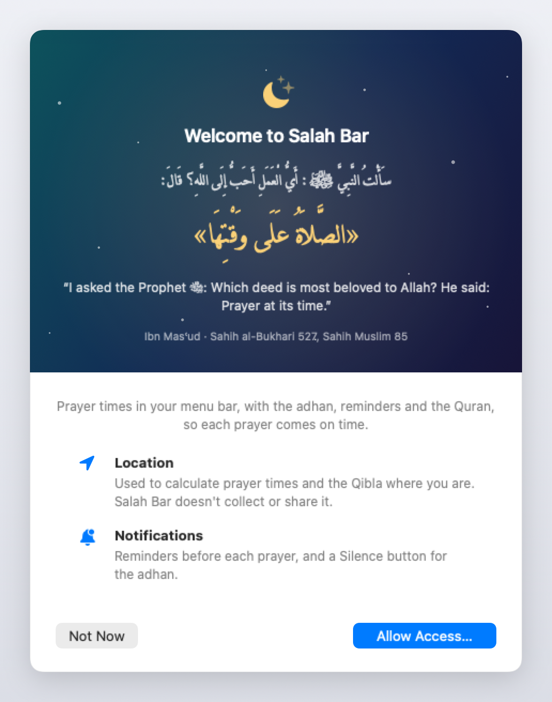 | 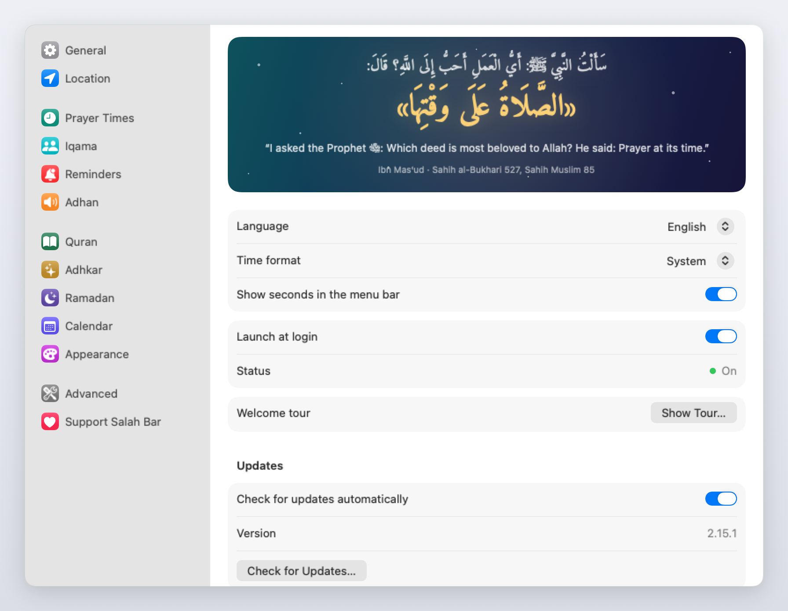 | 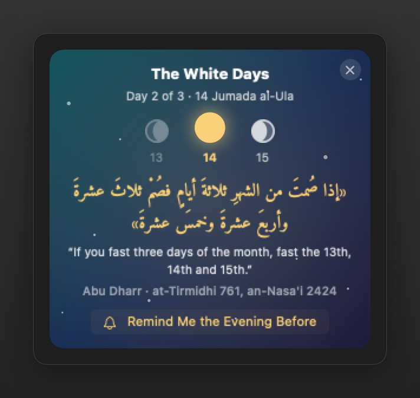 |

| Menu panel | Large widget | بالعربية |
|---|---|---|
| 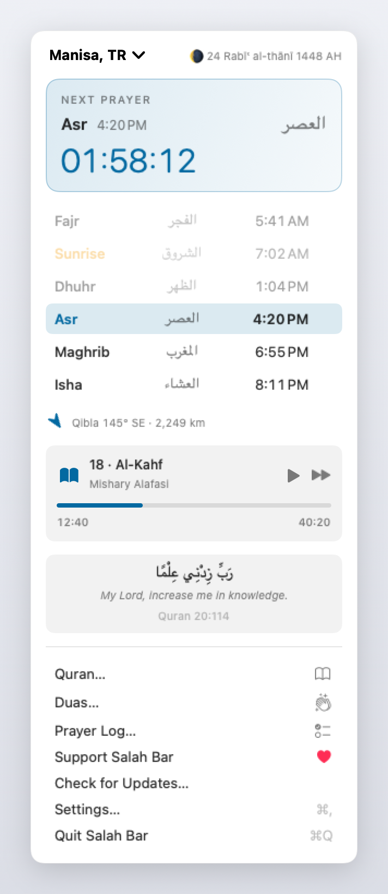 | 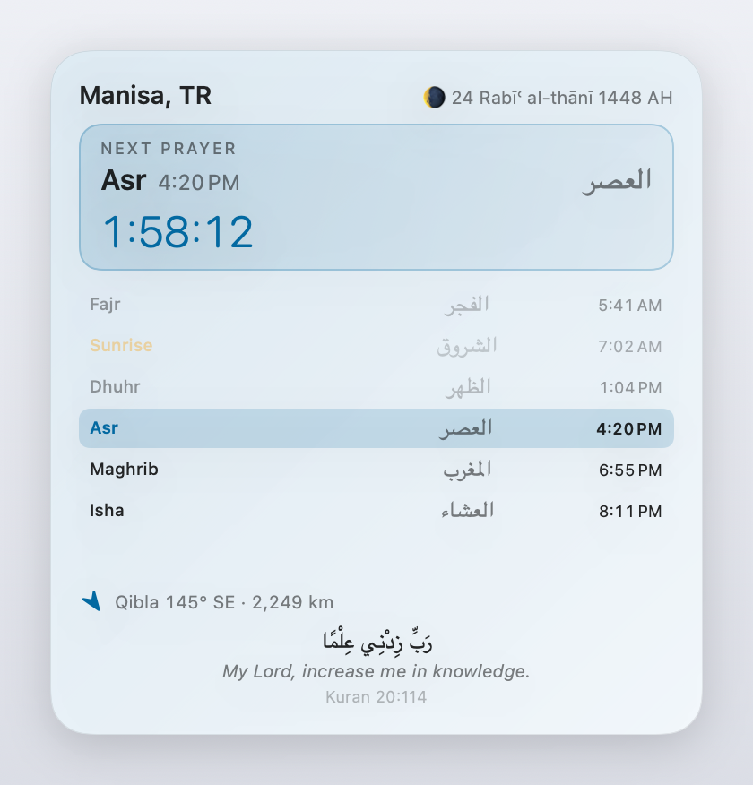 | 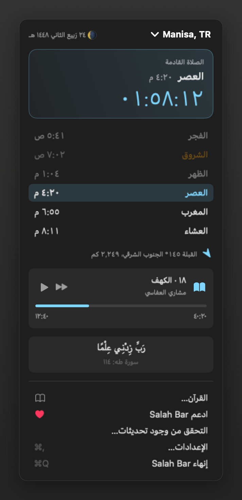 |

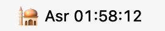 &nbsp; 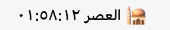

**Listen to the Quran**: pick a reciter, press ▶ on a surah, and keep favourites for offline listening.

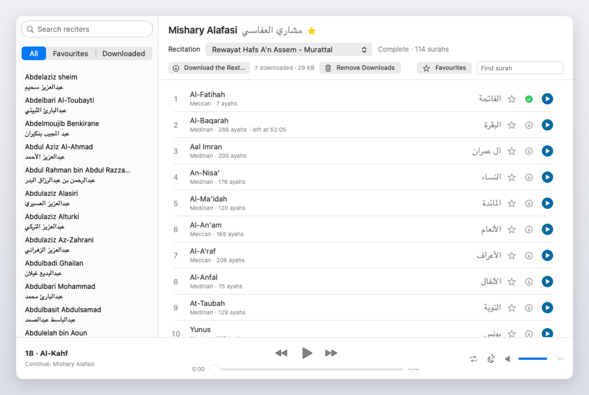

---

## Install

🇹🇷 [Türkçe kurulum](#kurulum-tr) · 🇸🇦 [التثبيت بالعربية](#install-ar) · 🇵🇰 [اردو میں انسٹال کریں](#install-ur) · 🇮🇩 [Pemasangan dalam Bahasa Indonesia](#install-id) · 🇲🇾 [Pemasangan dalam Bahasa Melayu](#install-ms) · 🇫🇷 [Installation en français](#install-fr) · 🇷🇺 [Установка на русском](#install-ru) · 🇮🇷 [نصب به فارسی](#install-fa)

> [!IMPORTANT]
> You need **macOS 14 Sonoma or later**.

### Option 1: one line in Terminal (easiest, no warnings)

1. Open **Terminal** (Applications → Utilities → Terminal).
2. Paste this line and press **Return**:

   ```bash
   curl -fsSL https://raw.githubusercontent.com/be-liever95/salah-bar/main/install.sh | bash
   ```

3. Wait for **"✓ Salah Bar … was installed"**. Salah Bar opens by itself, with a
   short **welcome tour** that sets it up with you. (Behind Terminal? Look for 🕌 at
   the top of your screen.)
4. In the tour, click **Allow** for **Location** and **Notifications**. Your
   location is used to calculate prayer times and the Qibla, and Salah Bar
   never collects or shares it ([privacy policy](PRIVACY.md)).
5. Optional: add the desktop widget. Right-click the desktop → **Edit
   Widgets…** → search **Salah Bar** → drag in a size.

> [!TIP]
> This way shows **no security warning**, because a file downloaded by Terminal
> isn't marked as "downloaded from the internet". Run the same line again any
> time to reinstall or update.

### Option 2: download the disk image

1. Download **`Salah-Bar-<version>.dmg`** from the
   [latest release](https://github.com/be-liever95/salah-bar/releases/latest).
2. Double-click it. **macOS will block it the first time** (see the warning below).
3. Allow it once (steps below), then open the `.dmg` again.
4. Drag **Salah Bar** onto **Applications**, open it from Applications, and
   follow steps 4–5 of Option 1.

> [!WARNING]
> **The first time you open the download, macOS says it "could not verify" it.**
> This is expected: Salah Bar is free and isn't notarized by Apple, which needs
> a paid developer account. **Don't click "Move to Trash".** Click **Done** and
> allow it once as shown below. Updates afterwards install with no warning.
>
> 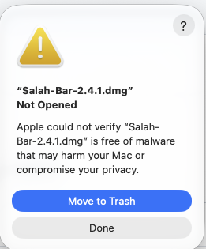

#### Allow it once

**macOS 15 Sequoia and later**

1. Click **Done** on the warning.
2. Open **System Settings → Privacy & Security**, and scroll down to **Security**.
3. Next to *"Salah-Bar-….dmg" was blocked*, click **Open Anyway**.
4. Confirm with **Open Anyway** and your Mac password, then open the `.dmg` again.

**macOS 14 Sonoma**

Right-click (or Control-click) the `.dmg`, choose **Open**, then click **Open**.

**Any macOS: with Terminal**

```bash
xattr -d com.apple.quarantine ~/Downloads/Salah-Bar-*.dmg
```

> [!NOTE]
> This command **prints nothing when it works**. Just open the `.dmg` again
> afterwards. If it says *No such file*, the download has a different name or
> location; run `ls ~/Downloads/Salah*` to find it.

### Updating

Salah Bar updates itself. It checks once a day, or choose **🕌 → Check for
Updates…**. Updates install **without** any security warning.

<a id="kurulum-tr"></a>

### 🇹🇷 Türkçe kurulum

**macOS 14 Sonoma veya üzeri gerekir.** Windows kullanıyorsanız: **[Windows için Salah Bar](https://github.com/be-liever95/salah-bar-windows-releases/releases/latest)**.

**1. Yol: Terminal'de tek satır (en kolayı, uyarı yok)**

1. **Terminal**'i açın (Uygulamalar → İzlenceler → Terminal).
2. Şu satırı yapıştırıp **Return** tuşuna basın:

   ```bash
   curl -fsSL https://raw.githubusercontent.com/be-liever95/salah-bar/main/install.sh | bash
   ```

3. **"✓ Salah Bar … was installed"** yazısını bekleyin. Salah Bar kendiliğinden açılır
   ve kurulumu sizinle yapan kısa bir **tanıtım turu** başlar. (Terminal'in arkasında mı?
   Ekranın üstünde 🕌'ye bakın.)
4. Turda **Konum** ve **Bildirimler** için **İzin Ver**'e tıklayın. Konumunuz
   yalnızca namaz vakitlerini ve kıbleyi hesaplamak için kullanılır; Salah Bar onu toplamaz veya paylaşmaz.
5. İsteğe bağlı: masaüstüne sağ tıklayın → **Araç Takımlarını Düzenle…** →
   **Salah Bar** arayın → bir boyutu sürükleyip bırakın.

> 💡 **İpucu:** Bu yolla **hiçbir güvenlik uyarısı çıkmaz**, çünkü Terminal'in
> indirdiği dosya "internetten indirildi" olarak işaretlenmez. Yeniden kurmak veya
> güncellemek için aynı satırı istediğiniz zaman tekrar çalıştırabilirsiniz.

**2. Yol: Disk görüntüsünü (.dmg) indirin**

1. [Son sürümden](https://github.com/be-liever95/salah-bar/releases/latest)
   **`Salah-Bar-<sürüm>.dmg`** dosyasını indirin.
2. Çift tıklayın. **macOS ilk seferde dosyayı engeller** (aşağıdaki uyarıya bakın).
3. Bir kez izin verin (aşağıdaki adımlar), sonra `.dmg`'yi tekrar açın.
4. **Salah Bar**'ı **Uygulamalar** klasörüne sürükleyin, oradan açın ve 1. Yol'un
   4–5. adımlarını izleyin.

> ⚠️ **Uyarı: İndirdiğiniz dosyayı ilk kez açtığınızda macOS, Apple'ın dosyanın
> kötü amaçlı yazılım içermediğini "doğrulayamadığını" söyler.** Bu beklenen bir
> durumdur: Salah Bar ücretsizdir ve Apple tarafından onaylanmamıştır (bunun için
> ücretli bir geliştirici hesabı gerekir). **"Çöp Sepetine Taşı"ya tıklamayın.**
> **Bitti**'ye tıklayın ve aşağıdaki gibi bir kez izin verin. Sonraki güncellemeler
> hiçbir uyarı olmadan kurulur.
>
> 

**Bir kez izin verin**

*macOS 15 Sequoia ve sonrası*

1. Uyarıda **Bitti**'ye tıklayın.
2. **Sistem Ayarları → Gizlilik ve Güvenlik**'i açın ve **Güvenlik** bölümüne inin.
3. *"Salah-Bar-….dmg" engellendi* mesajının yanındaki **Yine de Aç**'a tıklayın.
4. **Yine de Aç** ve Mac parolanızla onaylayın, sonra `.dmg`'yi tekrar açın.

*macOS 14 Sonoma*

`.dmg` dosyasına sağ tıklayın (veya Control tuşuyla tıklayın), **Aç**'ı seçin ve
ardından **Aç**'a tıklayın.

*Her macOS sürümünde: Terminal ile*

```bash
xattr -d com.apple.quarantine ~/Downloads/Salah-Bar-*.dmg
```

> ℹ️ **Not:** Bu komut **başarılı olduğunda hiçbir şey yazmaz**. Ardından `.dmg`'yi
> tekrar açmanız yeterli. *No such file* derse dosyanın adı veya yeri farklıdır;
> bulmak için `ls ~/Downloads/Salah*` komutunu çalıştırın.

**Güncelleme:** Salah Bar kendini günceller. Günde bir kez denetler, ya da
**🕌 → Güncellemeleri Denetle…**'yi seçin. Güncellemeler **hiçbir uyarı olmadan** kurulur.

<a id="install-ar"></a>

<div dir="rtl">

### 🇸🇦 التثبيت بالعربية

**يتطلب macOS 14 Sonoma أو أحدث.** على Windows؟ نزّل **[Salah Bar لنظام Windows](https://github.com/be-liever95/salah-bar-windows-releases/releases/latest)**.

**الطريقة الأولى: سطر واحد في Terminal (الأسهل، بلا تحذيرات)**

1. افتح تطبيق **Terminal** (التطبيقات ← الأدوات المساعدة ← Terminal).
2. الصق السطر التالي واضغط مفتاح **Return**:

</div>

```bash
curl -fsSL https://raw.githubusercontent.com/be-liever95/salah-bar/main/install.sh | bash
```

<div dir="rtl">

3. انتظر ظهور رسالة **"✓ Salah Bar … was installed"**، وسيفتح Salah Bar تلقائيًا
   مع **جولة تعريفية** قصيرة تُعِدّه معك. (إن كانت خلف نافذة Terminal فابحث عن 🕌 أعلى الشاشة.)
4. في الجولة، اضغط **سماح** للموقع والإشعارات. يُستخدم موقعك لحساب مواقيت الصلاة
   واتجاه القبلة فقط، ولا يجمعه Salah Bar ولا يشاركه.
5. اختياري: انقر بزر الماوس الأيمن على سطح المكتب ← **تحرير الأدوات…** ← ابحث عن
   **Salah Bar** ← اسحب الحجم الذي تريده.

> 💡 **نصيحة:** لا يظهر **أي تحذير أمني** بهذه الطريقة، لأن الملف الذي ينزّله
> Terminal لا يُعلَّم بأنه «منزَّل من الإنترنت». يمكنك تشغيل السطر نفسه في أي وقت
> لإعادة التثبيت أو التحديث.

**الطريقة الثانية: تنزيل ملف ‎.dmg**

1. نزّل ملف **‎`Salah-Bar-<الإصدار>.dmg`** من
   [آخر إصدار](https://github.com/be-liever95/salah-bar/releases/latest).
2. انقر عليه مرتين. **سيمنعه macOS في المرة الأولى** (انظر التحذير أدناه).
3. اسمح به مرة واحدة (الخطوات أدناه)، ثم افتح الملف مجددًا.
4. اسحب **Salah Bar** إلى مجلد **التطبيقات**، وافتحه من هناك، ثم اتبع الخطوتين
   ٤ و٥ من الطريقة الأولى.

> ⚠️ **تحذير: عند فتح الملف المنزَّل لأول مرة، يقول macOS إن Apple «لم تتمكن من
> التحقق» من خلوّه من البرامج الضارة.** هذا أمر متوقَّع: Salah Bar مجاني وغير
> موثَّق من Apple (فذلك يتطلب حساب مطوّر مدفوعًا). **لا تضغط «نقل إلى سلة
> المهملات»**. اضغط **تم** ثم اسمح به مرة واحدة كما هو موضّح أدناه. التحديثات بعد
> ذلك تُثبَّت دون أي تحذير.
>
> 

**السماح به مرة واحدة**

*macOS 15 Sequoia وأحدث*

1. اضغط **تم** في نافذة التحذير.
2. افتح **إعدادات النظام ← الخصوصية والأمن**، وانزل إلى قسم **الأمن**.
3. بجانب رسالة حظر ملف Salah-Bar، اضغط **فتح على أي حال**.
4. أكّد بالضغط على **فتح على أي حال** وكلمة سر جهازك، ثم افتح الملف مجددًا.

*macOS 14 Sonoma*

انقر بزر الماوس الأيمن (أو مع مفتاح Control) على ملف ‎.dmg، واختر **فتح**، ثم
اضغط **فتح**.

*أي إصدار من macOS: باستخدام Terminal*

</div>

```bash
xattr -d com.apple.quarantine ~/Downloads/Salah-Bar-*.dmg
```

<div dir="rtl">

> ℹ️ **ملاحظة:** هذا الأمر **لا يطبع شيئًا عند نجاحه**، فقط افتح الملف مجددًا بعده.
> وإن ظهرت رسالة *No such file* فاسم الملف أو مكانه مختلف؛ نفّذ الأمر
> ‎`ls ~/Downloads/Salah*`‎ لمعرفته.

**التحديث:** يحدّث Salah Bar نفسه تلقائيًا؛ يتحقق مرة يوميًا، أو اختر
**🕌 ← التحقق من وجود تحديثات…**. تُثبَّت التحديثات **دون أي تحذير**.

</div>

<a id="install-ur"></a>

<div dir="rtl">

### 🇵🇰 اردو میں انسٹال کریں

**macOS 14 Sonoma یا اس سے نیا درکار ہے۔** Windows پر ہیں؟ **[Windows کے لیے Salah Bar](https://github.com/be-liever95/salah-bar-windows-releases/releases/latest)** ڈاؤن لوڈ کریں۔

**پہلا طریقہ: Terminal میں ایک سطر (سب سے آسان، کوئی وارننگ نہیں)**

1. **Terminal** کھولیں (Applications ← Utilities ← Terminal)۔
2. یہ سطر پیسٹ کریں اور **Return** دبائیں:

</div>

```bash
curl -fsSL https://raw.githubusercontent.com/be-liever95/salah-bar/main/install.sh | bash
```

<div dir="rtl">

3. **"✓ Salah Bar … was installed"** کا انتظار کریں۔ Salah Bar خود کھل جائے گا، اور ایک
   مختصر **تعارفی جائزہ** آپ کے ساتھ اسے سیٹ کرے گا۔ (Terminal کے پیچھے ہے؟ اسکرین کے
   اوپر 🕌 تلاش کریں۔)
4. جائزے میں **مقام** اور **اطلاعات** کے لیے **Allow** پر کلک کریں۔ آپ کا مقام صرف نماز کے
   اوقات اور قبلے کے حساب کے لیے استعمال ہوتا ہے؛ Salah Bar اسے کبھی جمع یا شیئر نہیں کرتا۔
5. اختیاری: ڈیسک ٹاپ پر رائٹ کلک کریں ← **Edit Widgets…** ← **Salah Bar** تلاش کریں ←
   کوئی سائز ڈریگ کریں۔

> 💡 **مشورہ:** اس طریقے سے **کوئی سیکیورٹی وارننگ نہیں آتی**، کیونکہ Terminal سے ڈاؤن لوڈ کی گئی
> فائل پر «انٹرنیٹ سے ڈاؤن لوڈ شدہ» کا نشان نہیں لگتا۔ دوبارہ انسٹال یا اپ ڈیٹ کرنے کے لیے
> یہی سطر کسی بھی وقت دوبارہ چلائیں۔

**دوسرا طریقہ: ‎.dmg فائل ڈاؤن لوڈ کریں**

1. [تازہ ترین ریلیز](https://github.com/be-liever95/salah-bar/releases/latest) سے
   **‎`Salah-Bar-<version>.dmg`** ڈاؤن لوڈ کریں۔
2. اس پر ڈبل کلک کریں۔ **macOS پہلی بار اسے روک دے گا** (نیچے وارننگ دیکھیں)۔
3. ایک بار اجازت دیں (نیچے کے مراحل)، پھر ‎`.dmg` دوبارہ کھولیں۔
4. **Salah Bar** کو **Applications** میں ڈریگ کریں، وہاں سے کھولیں، اور پہلے طریقے کے
   مراحل ۴–۵ پر عمل کریں۔

> ⚠️ **وارننگ: ڈاؤن لوڈ کو پہلی بار کھولنے پر macOS کہتا ہے کہ Apple اس کی «تصدیق نہیں کر
> سکا»۔** یہ متوقع ہے: Salah Bar مفت ہے اور Apple سے نوٹرائزڈ نہیں (اس کے لیے ادائیگی والا
> ڈیویلپر اکاؤنٹ درکار ہے)۔ **"Move to Trash" پر کلک نہ کریں۔** **Done** پر کلک کریں اور
> نیچے دکھائے گئے طریقے سے ایک بار اجازت دیں۔ اس کے بعد اپ ڈیٹس بغیر کسی وارننگ کے انسٹال ہوتی ہیں۔
>
> 

**ایک بار اجازت دیں**

*macOS 15 Sequoia اور اس کے بعد*

1. وارننگ پر **Done** پر کلک کریں۔
2. **System Settings ← Privacy & Security** کھولیں اور نیچے **Security** تک جائیں۔
3. *"Salah-Bar-….dmg" was blocked* کے ساتھ **Open Anyway** پر کلک کریں۔
4. **Open Anyway** اور اپنے Mac کے پاس ورڈ سے تصدیق کریں، پھر ‎`.dmg` دوبارہ کھولیں۔

*macOS 14 Sonoma*

‎`.dmg` پر رائٹ کلک (یا Control کے ساتھ کلک) کریں، **Open** منتخب کریں، پھر **Open** پر کلک کریں۔

*کسی بھی macOS پر: Terminal سے*

</div>

```bash
xattr -d com.apple.quarantine ~/Downloads/Salah-Bar-*.dmg
```

<div dir="rtl">

> ℹ️ **نوٹ:** یہ کمانڈ **کامیاب ہونے پر کچھ نہیں دکھاتی**۔ اس کے بعد بس ‎`.dmg` دوبارہ کھولیں۔
> اگر *No such file* آئے تو ڈاؤن لوڈ کا نام یا جگہ مختلف ہے؛ اسے تلاش کرنے کے لیے
> ‎`ls ~/Downloads/Salah*`‎ چلائیں۔

**اپ ڈیٹ:** Salah Bar خود کو اپ ڈیٹ کرتا ہے۔ یہ دن میں ایک بار چیک کرتا ہے، یا
**🕌 ← اپ ڈیٹس چیک کریں…** منتخب کریں۔ اپ ڈیٹس **بغیر کسی** سیکیورٹی وارننگ کے انسٹال ہوتی ہیں۔

</div>

<a id="install-id"></a>

### 🇮🇩 Pemasangan dalam Bahasa Indonesia

**Memerlukan macOS 14 Sonoma atau yang lebih baru.** Memakai Windows? Unduh **[Salah Bar untuk Windows](https://github.com/be-liever95/salah-bar-windows-releases/releases/latest)**.

**Cara 1: satu baris di Terminal (paling mudah, tanpa peringatan)**

1. Buka **Terminal** (Aplikasi → Utilitas → Terminal).
2. Tempel baris ini dan tekan **Return**:

   ```bash
   curl -fsSL https://raw.githubusercontent.com/be-liever95/salah-bar/main/install.sh | bash
   ```

3. Tunggu sampai muncul **"✓ Salah Bar … was installed"**. Salah Bar terbuka sendiri,
   dengan **tur perkenalan** singkat yang menyiapkannya bersama Anda. (Tertutup
   Terminal? Cari 🕌 di bagian atas layar.)
4. Dalam tur, klik **Izinkan** untuk **Lokasi** dan **Notifikasi**. Lokasi Anda hanya
   dipakai untuk menghitung waktu salat dan arah kiblat; Salah Bar tidak pernah
   mengumpulkan atau membagikannya.
5. Opsional: tambahkan widget desktop. Klik kanan desktop → **Edit Widget…** →
   cari **Salah Bar** → seret salah satu ukuran.

> 💡 **Tips:** Cara ini **tidak memunculkan peringatan keamanan**, karena berkas yang
> diunduh lewat Terminal tidak ditandai "diunduh dari internet". Jalankan baris yang
> sama kapan saja untuk memasang ulang atau memperbarui.

**Cara 2: unduh berkas .dmg**

1. Unduh **`Salah-Bar-<versi>.dmg`** dari
   [rilis terbaru](https://github.com/be-liever95/salah-bar/releases/latest).
2. Klik dua kali. **macOS akan memblokirnya pada kali pertama** (lihat peringatan di bawah).
3. Izinkan sekali (langkah di bawah), lalu buka `.dmg` lagi.
4. Seret **Salah Bar** ke **Aplikasi**, buka dari sana, lalu ikuti langkah 4–5 pada Cara 1.

> ⚠️ **Peringatan: saat pertama kali membuka unduhan, macOS mengatakan Apple "tidak dapat
> memverifikasi" bahwa berkas itu bebas malware.** Ini wajar: Salah Bar gratis dan tidak
> dinotarisasi oleh Apple (yang memerlukan akun pengembang berbayar). **Jangan klik
> "Pindahkan ke Tempat Sampah".** Klik **Selesai** dan izinkan sekali seperti di bawah.
> Pembaruan selanjutnya terpasang tanpa peringatan.
>
> 

**Izinkan sekali**

*macOS 15 Sequoia dan yang lebih baru*

1. Klik **Selesai** pada peringatan.
2. Buka **Pengaturan Sistem → Privasi & Keamanan**, lalu gulir ke **Keamanan**.
3. Di sebelah *"Salah-Bar-….dmg" diblokir*, klik **Tetap Buka**.
4. Konfirmasi dengan **Tetap Buka** dan kata sandi Mac Anda, lalu buka `.dmg` lagi.

*macOS 14 Sonoma*

Klik kanan (atau klik sambil menekan Control) berkas `.dmg`, pilih **Buka**, lalu klik **Buka**.

*macOS versi apa pun: lewat Terminal*

```bash
xattr -d com.apple.quarantine ~/Downloads/Salah-Bar-*.dmg
```

> ℹ️ **Catatan:** Perintah ini **tidak menampilkan apa pun jika berhasil**. Cukup buka
> `.dmg` lagi setelahnya. Jika muncul *No such file*, nama atau lokasi unduhannya
> berbeda; jalankan `ls ~/Downloads/Salah*` untuk menemukannya.

**Pembaruan:** Salah Bar memperbarui dirinya sendiri. Ia memeriksa sekali sehari, atau
pilih **🕌 → Periksa Pembaruan…**. Pembaruan terpasang **tanpa** peringatan keamanan.

<a id="install-ms"></a>

### 🇲🇾 Pemasangan dalam Bahasa Melayu

**Memerlukan macOS 14 Sonoma atau lebih baharu.** Menggunakan Windows? Muat turun **[Salah Bar untuk Windows](https://github.com/be-liever95/salah-bar-windows-releases/releases/latest)**.

**Cara 1: satu baris dalam Terminal (paling mudah, tiada amaran)**

1. Buka **Terminal** (Aplikasi → Utiliti → Terminal).
2. Tampal baris ini dan tekan **Return**:

   ```bash
   curl -fsSL https://raw.githubusercontent.com/be-liever95/salah-bar/main/install.sh | bash
   ```

3. Tunggu sehingga **"✓ Salah Bar … was installed"** muncul. Salah Bar dibuka sendiri,
   dengan **lawatan pengenalan** ringkas yang menyediakannya bersama anda. (Di belakang
   Terminal? Cari 🕌 di bahagian atas skrin.)
4. Dalam lawatan itu, klik **Benarkan** untuk **Lokasi** dan **Pemberitahuan**. Lokasi anda
   hanya digunakan untuk mengira waktu solat dan arah kiblat; Salah Bar tidak pernah
   mengumpul atau berkongsinya.
5. Pilihan: tambah widget desktop. Klik kanan desktop → **Edit Widget…** → cari
   **Salah Bar** → seret satu saiz.

> 💡 **Petua:** Cara ini **tidak menunjukkan sebarang amaran keselamatan**, kerana fail
> yang dimuat turun oleh Terminal tidak ditanda sebagai "dimuat turun dari internet".
> Jalankan baris yang sama pada bila-bila masa untuk memasang semula atau mengemas kini.

**Cara 2: muat turun fail .dmg**

1. Muat turun **`Salah-Bar-<versi>.dmg`** daripada
   [keluaran terkini](https://github.com/be-liever95/salah-bar/releases/latest).
2. Dwiklik padanya. **macOS akan menyekatnya pada kali pertama** (lihat amaran di bawah).
3. Benarkan sekali (langkah di bawah), kemudian buka `.dmg` semula.
4. Seret **Salah Bar** ke **Aplikasi**, buka dari sana, dan ikut langkah 4–5 Cara 1.

> ⚠️ **Amaran: kali pertama anda membuka muat turun itu, macOS berkata Apple "tidak dapat
> mengesahkan" bahawa ia bebas daripada perisian hasad.** Ini dijangka: Salah Bar percuma
> dan tidak dinotari oleh Apple (yang memerlukan akaun pembangun berbayar). **Jangan klik
> "Alih ke Sampah".** Klik **Selesai** dan benarkan sekali seperti di bawah. Kemas kini
> selepas itu dipasang tanpa amaran.
>
> 

**Benarkan sekali**

*macOS 15 Sequoia dan lebih baharu*

1. Klik **Selesai** pada amaran.
2. Buka **Seting Sistem → Privasi & Keselamatan**, dan tatal ke **Keselamatan**.
3. Di sebelah *"Salah-Bar-….dmg" disekat*, klik **Buka Juga**.
4. Sahkan dengan **Buka Juga** dan kata laluan Mac anda, kemudian buka `.dmg` semula.

*macOS 14 Sonoma*

Klik kanan (atau klik sambil menekan Control) fail `.dmg`, pilih **Buka**, kemudian klik **Buka**.

*Mana-mana macOS: dengan Terminal*

```bash
xattr -d com.apple.quarantine ~/Downloads/Salah-Bar-*.dmg
```

> ℹ️ **Nota:** Perintah ini **tidak mencetak apa-apa apabila berjaya**. Buka sahaja `.dmg`
> semula selepas itu. Jika ia berkata *No such file*, nama atau lokasi muat turun itu
> berbeza; jalankan `ls ~/Downloads/Salah*` untuk mencarinya.

**Kemas kini:** Salah Bar mengemas kini dirinya sendiri. Ia menyemak sekali sehari, atau
pilih **🕌 → Semak Kemas Kini…**. Kemas kini dipasang **tanpa** sebarang amaran keselamatan.

<a id="install-fr"></a>

### 🇫🇷 Installation en français

**macOS 14 Sonoma ou plus récent est requis.** Sous Windows ? Téléchargez **[Salah Bar pour Windows](https://github.com/be-liever95/salah-bar-windows-releases/releases/latest)**.

**Méthode 1 : une ligne dans le Terminal (la plus simple, sans avertissement)**

1. Ouvrez le **Terminal** (Applications → Utilitaires → Terminal).
2. Collez cette ligne et appuyez sur **Retour** :

   ```bash
   curl -fsSL https://raw.githubusercontent.com/be-liever95/salah-bar/main/install.sh | bash
   ```

3. Attendez **« ✓ Salah Bar … was installed »**. Salah Bar s'ouvre tout seul, avec une
   courte **visite de bienvenue** qui le configure avec vous. (Caché derrière le
   Terminal ? Cherchez 🕌 en haut de l'écran.)
4. Dans la visite, cliquez sur **Autoriser** pour la **localisation** et les
   **notifications**. Votre position sert uniquement à calculer les horaires de prière et
   la qibla ; Salah Bar ne la collecte ni ne la partage jamais.
5. Facultatif : ajoutez le widget de bureau. Clic droit sur le bureau → **Modifier les
   widgets…** → cherchez **Salah Bar** → faites glisser une taille.

> 💡 **Astuce :** cette méthode **n'affiche aucun avertissement de sécurité**, car un
> fichier téléchargé par le Terminal n'est pas marqué comme « téléchargé depuis
> Internet ». Relancez la même ligne à tout moment pour réinstaller ou mettre à jour.

**Méthode 2 : télécharger l'image disque (.dmg)**

1. Téléchargez **`Salah-Bar-<version>.dmg`** depuis la
   [dernière version](https://github.com/be-liever95/salah-bar/releases/latest).
2. Double-cliquez dessus. **macOS le bloque la première fois** (voir l'avertissement ci-dessous).
3. Autorisez-le une fois (étapes ci-dessous), puis rouvrez le `.dmg`.
4. Faites glisser **Salah Bar** dans **Applications**, ouvrez-le depuis là, puis suivez
   les étapes 4–5 de la méthode 1.

> ⚠️ **Avertissement : à la première ouverture du téléchargement, macOS indique qu'Apple
> « n'a pas pu vérifier » qu'il est exempt de logiciels malveillants.** C'est normal :
> Salah Bar est gratuit et n'est pas notarié par Apple (ce qui exige un compte développeur
> payant). **Ne cliquez pas sur « Placer dans la corbeille ».** Cliquez sur **Terminé** et
> autorisez-le une fois comme indiqué ci-dessous. Les mises à jour suivantes s'installent
> sans avertissement.
>
> 

**L'autoriser une fois**

*macOS 15 Sequoia et plus récent*

1. Cliquez sur **Terminé** dans l'avertissement.
2. Ouvrez **Réglages Système → Confidentialité et sécurité**, puis descendez jusqu'à **Sécurité**.
3. À côté de *« Salah-Bar-….dmg » a été bloqué*, cliquez sur **Ouvrir quand même**.
4. Confirmez avec **Ouvrir quand même** et le mot de passe de votre Mac, puis rouvrez le `.dmg`.

*macOS 14 Sonoma*

Clic droit (ou clic avec la touche Contrôle) sur le `.dmg`, choisissez **Ouvrir**, puis
cliquez sur **Ouvrir**.

*Toute version de macOS : avec le Terminal*

```bash
xattr -d com.apple.quarantine ~/Downloads/Salah-Bar-*.dmg
```

> ℹ️ **Remarque :** cette commande **n'affiche rien quand elle réussit**. Rouvrez simplement
> le `.dmg` ensuite. Si elle indique *No such file*, le téléchargement a un autre nom ou
> un autre emplacement ; lancez `ls ~/Downloads/Salah*` pour le trouver.

**Mise à jour :** Salah Bar se met à jour tout seul. Il vérifie une fois par jour, ou
choisissez **🕌 → Rechercher des mises à jour…**. Les mises à jour s'installent **sans**
aucun avertissement de sécurité.

<a id="install-ru"></a>

### 🇷🇺 Установка на русском

**Требуется macOS 14 Sonoma или новее.** У вас Windows? Скачайте **[Salah Bar для Windows](https://github.com/be-liever95/salah-bar-windows-releases/releases/latest)**.

**Способ 1: одна строка в Терминале (самый простой, без предупреждений)**

1. Откройте **Терминал** (Программы → Утилиты → Терминал).
2. Вставьте эту строку и нажмите **Return**:

   ```bash
   curl -fsSL https://raw.githubusercontent.com/be-liever95/salah-bar/main/install.sh | bash
   ```

3. Дождитесь надписи **«✓ Salah Bar … was installed»**. Salah Bar откроется сам, а короткий
   **вводный тур** настроит его вместе с вами. (Скрылся за Терминалом? Ищите 🕌 в верхней
   части экрана.)
4. В туре нажмите **Разрешить** для **геопозиции** и **уведомлений**. Геопозиция нужна
   только для расчёта времени намазов и киблы; Salah Bar никогда не собирает и не передаёт её.
5. По желанию: добавьте виджет на рабочий стол. Правый клик по рабочему столу →
   **Редактировать виджеты…** → найдите **Salah Bar** → перетащите нужный размер.

> 💡 **Совет:** при этом способе **не появляется предупреждение безопасности**, потому что
> файл, скачанный Терминалом, не помечается как «загруженный из интернета». Запускайте
> ту же строку в любое время, чтобы переустановить или обновить.

**Способ 2: скачать образ диска (.dmg)**

1. Скачайте **`Salah-Bar-<версия>.dmg`** из
   [последнего выпуска](https://github.com/be-liever95/salah-bar/releases/latest).
2. Дважды нажмите на него. **В первый раз macOS его заблокирует** (см. предупреждение ниже).
3. Разрешите один раз (шаги ниже), затем снова откройте `.dmg`.
4. Перетащите **Salah Bar** в **Программы**, откройте оттуда и выполните шаги 4–5 из способа 1.

> ⚠️ **Предупреждение: при первом открытии загрузки macOS сообщает, что Apple «не удалось
> проверить» файл на отсутствие вредоносного ПО.** Это ожидаемо: Salah Bar бесплатен и не
> нотаризован Apple (для этого нужна платная учётная запись разработчика). **Не нажимайте
> «Переместить в Корзину».** Нажмите **Готово** и разрешите один раз, как показано ниже.
> Последующие обновления устанавливаются без предупреждений.
>
> 

**Разрешить один раз**

*macOS 15 Sequoia и новее*

1. Нажмите **Готово** в предупреждении.
2. Откройте **Системные настройки → Конфиденциальность и безопасность** и прокрутите до
   раздела **Безопасность**.
3. Рядом с сообщением *«Salah-Bar-….dmg» заблокирован* нажмите **Всё равно открыть**.
4. Подтвердите кнопкой **Всё равно открыть** и паролем Mac, затем снова откройте `.dmg`.

*macOS 14 Sonoma*

Нажмите на `.dmg` правой кнопкой (или с зажатой клавишей Control), выберите **Открыть**,
затем нажмите **Открыть**.

*Любая версия macOS: через Терминал*

```bash
xattr -d com.apple.quarantine ~/Downloads/Salah-Bar-*.dmg
```

> ℹ️ **Примечание:** при успехе эта команда **ничего не выводит**. Просто откройте `.dmg`
> снова. Если она пишет *No such file*, у загрузки другое имя или расположение; выполните
> `ls ~/Downloads/Salah*`, чтобы найти её.

**Обновление:** Salah Bar обновляется сам. Он проверяет обновления раз в день, или выберите
**🕌 → Проверить обновления…**. Обновления устанавливаются **без** предупреждений безопасности.

<a id="install-fa"></a>

<div dir="rtl">

### 🇮🇷 نصب به فارسی

**macOS 14 Sonoma یا جدیدتر لازم است.** Windows دارید؟ **[Salah Bar برای Windows](https://github.com/be-liever95/salah-bar-windows-releases/releases/latest)** را دانلود کنید.

**روش ۱: یک خط در Terminal (ساده‌ترین، بدون هشدار)**

1. **Terminal** را باز کنید (Applications ← Utilities ← Terminal).
2. این خط را بچسبانید و **Return** را بزنید:

</div>

```bash
curl -fsSL https://raw.githubusercontent.com/be-liever95/salah-bar/main/install.sh | bash
```

<div dir="rtl">

3. منتظر پیام **"✓ Salah Bar … was installed"** بمانید. Salah Bar خودش باز می‌شود و یک
   **تور خوش‌آمدگویی** کوتاه آن را همراه شما تنظیم می‌کند. (پشت Terminal پنهان شده؟ 🕌 را
   بالای صفحه پیدا کنید.)
4. در تور، برای **موقعیت مکانی** و **اعلان‌ها** روی **Allow** کلیک کنید. موقعیت شما فقط برای
   محاسبهٔ اوقات نماز و قبله به کار می‌رود؛ Salah Bar هرگز آن را جمع‌آوری یا ارسال نمی‌کند.
5. اختیاری: روی دسکتاپ راست‌کلیک کنید ← **Edit Widgets…** ← **Salah Bar** را جستجو کنید ←
   اندازهٔ دلخواه را بکشید.

> 💡 **نکته:** با این روش **هیچ هشدار امنیتی نمی‌بینید**، چون فایلی که Terminal دانلود می‌کند
> نشان «دانلودشده از اینترنت» نمی‌گیرد. برای نصب دوباره یا به‌روزرسانی، همین خط را هر وقت
> خواستید دوباره اجرا کنید.

**روش ۲: دانلود فایل ‎.dmg**

1. **‎`Salah-Bar-<version>.dmg`** را از
   [آخرین نسخه](https://github.com/be-liever95/salah-bar/releases/latest) دانلود کنید.
2. روی آن دوبار کلیک کنید. **macOS بار اول آن را مسدود می‌کند** (هشدار پایین را ببینید).
3. یک بار اجازه دهید (مراحل پایین)، سپس ‎`.dmg` را دوباره باز کنید.
4. **Salah Bar** را به **Applications** بکشید، از همان‌جا بازش کنید و مراحل ۴ و ۵ روش ۱
   را انجام دهید.

> ⚠️ **هشدار: هنگام اولین باز کردن فایل دانلودشده، macOS می‌گوید Apple نتوانسته آن را
> «بررسی کند».** این طبیعی است: Salah Bar رایگان است و توسط Apple نوتارایز نشده (این کار به
> حساب توسعه‌دهندهٔ پولی نیاز دارد). **روی "Move to Trash" کلیک نکنید.** روی **Done** کلیک
> کنید و یک بار به روش زیر اجازه دهید. به‌روزرسانی‌های بعدی بدون هشدار نصب می‌شوند.
>
> 

**یک بار اجازه دهید**

*macOS 15 Sequoia و جدیدتر*

1. در هشدار روی **Done** کلیک کنید.
2. **System Settings ← Privacy & Security** را باز کنید و تا بخش **Security** پایین بروید.
3. کنار پیام *"Salah-Bar-….dmg" was blocked* روی **Open Anyway** کلیک کنید.
4. با **Open Anyway** و رمز Mac خود تأیید کنید، سپس ‎`.dmg` را دوباره باز کنید.

*macOS 14 Sonoma*

روی ‎`.dmg` راست‌کلیک کنید (یا با Control کلیک کنید)، **Open** را انتخاب کنید، سپس روی **Open** کلیک کنید.

*هر نسخهٔ macOS: از Terminal*

</div>

```bash
xattr -d com.apple.quarantine ~/Downloads/Salah-Bar-*.dmg
```

<div dir="rtl">

> ℹ️ **توجه:** این فرمان **در صورت موفقیت چیزی نشان نمی‌دهد**. فقط ‎`.dmg` را دوباره باز کنید.
> اگر *No such file* دیدید، نام یا محل فایل دانلودشده فرق دارد؛ برای پیدا کردنش
> ‎`ls ~/Downloads/Salah*`‎ را اجرا کنید.

**به‌روزرسانی:** Salah Bar خودش به‌روز می‌شود. روزی یک بار بررسی می‌کند، یا
**🕌 ← بررسی به‌روزرسانی‌ها…** را انتخاب کنید. به‌روزرسانی‌ها **بدون** هیچ هشدار امنیتی نصب می‌شوند.

</div>

---

## Using Salah Bar

### The menu panel

Click the countdown in the menu bar to open the panel. It shows:

- the next prayer with a big countdown (and **Stop Flashing** during the warning before it)
- today's times, including Sunrise, and Imsak during Ramadan
- the Hijri date and an arrow pointing to the Qibla
- a city switcher for your current location and saved cities
- an ayah or dua that changes on the schedule you choose
- **Stop Adhan** while the adhan is playing
- the Quran mini-player once you've listened to something: play/pause, next
  surah, and a progress bar you can click or drag to jump within the surah
- **Quran…**, **Settings…** and **Quit Salah Bar**

### The welcome tour

On first launch, a short tour sets Salah Bar up with you, one step at a time:

1. **Welcome**: the hadith Salah Bar is built around, and your language (any of the 12).
2. **Location**: use your location, or choose a city instead.
3. **Prayer times**: today's times for that place, the calculation method (automatic
   for your country, or one you choose) and the Asr school.
4. **Notifications and the adhan**: allow reminders, and listen to the adhan.
5. **The menu bar**: where to find the countdown and what the panel shows.
6. **Make it yours**: a switch for each optional feature: Sunnah prayer tracking,
   "Did you pray?" reminders, dhikr cards, the Friday Al-Kahf and Sunnah fast reminders,
   the flash before the adhan, quiet in calls, and the Ramadan companion. Links open
   the iqama and calendar settings.
7. **Listen and remember**: the Quran and the Duas, each with a button to open it.
8. **Widgets and Siri**: how to add a widget and what to ask Siri.
9. **Done**: open Salah Bar when you log in, if you like.

Each step can be skipped, and **Settings → General → Welcome tour** shows it again.
Already using Salah Bar from before the tour? The menu panel offers it once:
**New: a quick tour → Take the Tour**.

> I asked the Prophet ﷺ: *"Which deed is most beloved to Allah?"* He said:
> **"Prayer at its time."** (Ibn Masʿud; Sahih al-Bukhari 527, Sahih Muslim 85)

| Welcome | Prayer times |
|---|---|
|  | 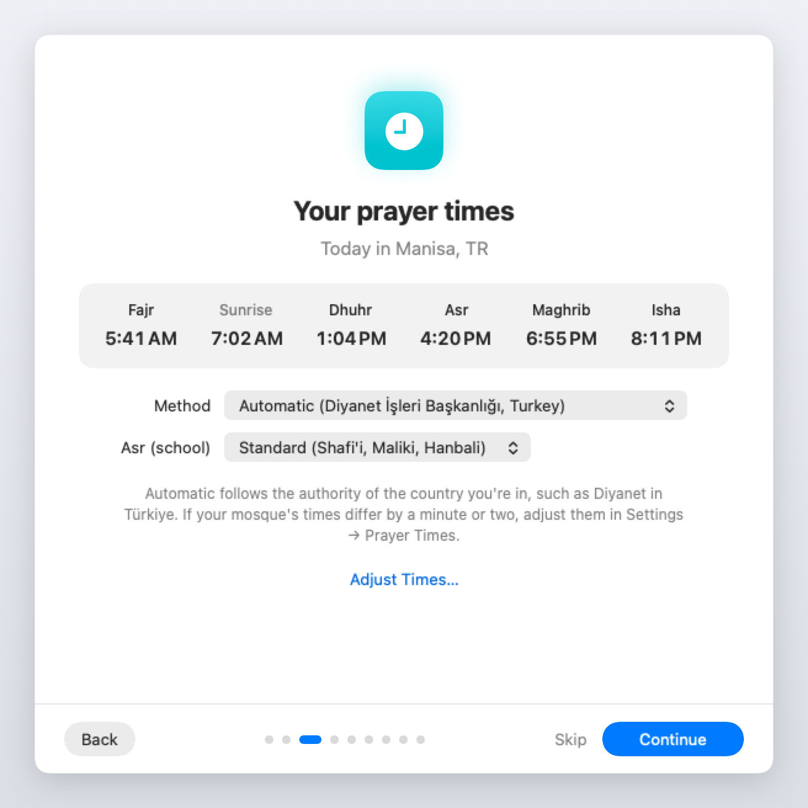 |
| **Make it yours** | **Listen and remember** |
| 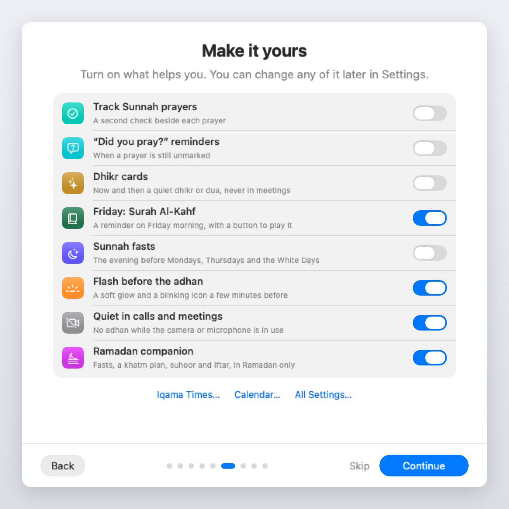 | 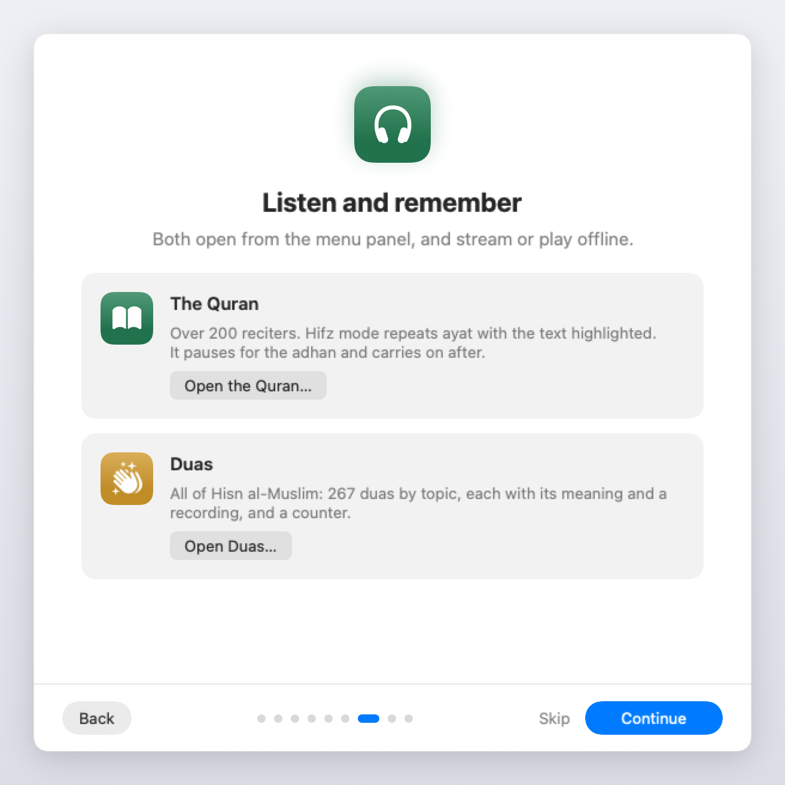 |

### Settings


Settings is laid out like System Settings: pages in a sidebar, each with its
own icon, and the hadith at the top of **General**.

| Page | What you can change |
|---|---|
| **General** | Language (English, Turkish, Arabic, Urdu, Indonesian, Malay, French, Russian, German, Bengali, Persian or Spanish), Arabic-Indic digits, seconds in the menu bar, launch at login, automatic updates |
| **Location** | Automatic location or a saved city, city search, adding a city by coordinates |
| **Prayer Times** | Calculation method, Asr school (Standard or Hanafi), per-prayer minute adjustments, Hijri date correction (±2 days) |
| **Ramadan** | The Ramadan companion and each of its reminders, the iftar countdown in the menu bar, the khatm plan, fasts to make up, Ramadan mode |
| **Iqama** | Your mosque's iqama for each prayer and for Jumu'ah, and a reminder before it |
| **Reminders** | When to remind you (10, 5 and 0 minutes before, or your own), and the Friday and Sunnah reminders |
| **Adhan** | Adhan on/off, volume, fade-in, staying quiet during calls, pausing other audio, adhan and Fajr adhan tracks with preview and trimming, **My adhans** (your own files and the online library) |
| **Quran** | What happens when the adhan is due while the Quran plays, playing on to the next surah, downloads and the space they use |
| **Calendar** | Warnings when a meeting overlaps a prayer, and prayer blocks in your calendar |
| **Appearance** | The "prayer is near" flash warning (minutes before, menu bar blink, screen-edge glow with a Preview), the ayah & dua (on/off, change every 15 min to once a day, which kinds) and the theme (System, Light or Dark) |
| **Advanced** | Remove the old SwiftBar version, import its settings again, open the logs folder |

### Listening to the Quran


Choose **Quran…** in the panel. Pick a reciter on the left (242 of them, with a
search in English, Arabic or Turkish), then press ▶ next to any surah.

- **Streams by default.** Nothing is downloaded and no space is used unless you ask.
- **Offline when you want it.** Press ⬇ next to a surah, or **Download All…** for
  a whole recitation (about 1.6 GB; Salah Bar tells you the size and your free
  space first, and you can pause and carry on). Downloaded surahs play with no
  internet. Remove them from the window's **Downloads** button or
  **Settings → Quran**.
- **Keep downloads on an external drive** if you like: **Settings → Quran →
  Download folder → Change…** (Salah Bar offers to move what you already have).
  If the drive is disconnected, you get a notification and everything streams
  from the internet, even a surah that was playing from the drive, carrying on
  where it was. When you plug it back in, downloads play offline again.
- **Mini-player in the menu panel:** play/pause, next surah, and a progress bar
  to click or drag, so you don't need the window open.
- **Carries on where you stopped**, per surah, even after quitting.
- **Repeat** a surah or the whole recitation, or play on to the next surah.
- **Sleep timer:** 15 to 90 minutes, or the end of the surah, fading out gently.
- **Favourites** for reciters and surahs.
- **Media keys and Control Centre** work while it plays.
- **Hifz mode**: choose an ayah range, how many times to repeat each ayah and the
  whole range, a pause between repeats and the speed. The Arabic text follows along
  with the current ayah highlighted. It works with the many reciters that mp3quran.net
  publishes ayah timings for, such as Alafasy, Husary, Minshawi, Abdul Basit, Sudais
  and Ghamdi, plus more (Mohammed Jibreel, Yasser Salamah, Maher Al-Muaiqly…) with
  ayah-by-ayah audio from [EveryAyah.com](https://everyayah.com). Text from
  [Tanzil.net](https://tanzil.net).
- **At prayer time** the recitation fades out, the adhan plays, then the
  recitation carries on. In **Settings → Quran** you can instead keep it paused
  after the adhan, or keep listening with no adhan.

Recitations are from [mp3quran.net](https://mp3quran.net).

| Arabic, dark | Settings → Quran |
|---|---|
| 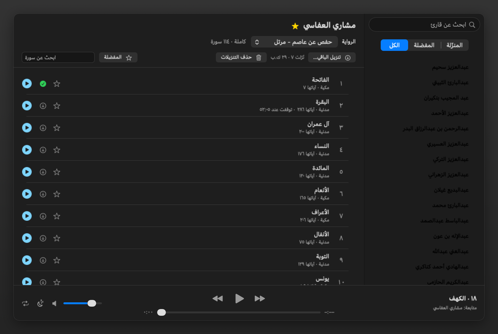 | 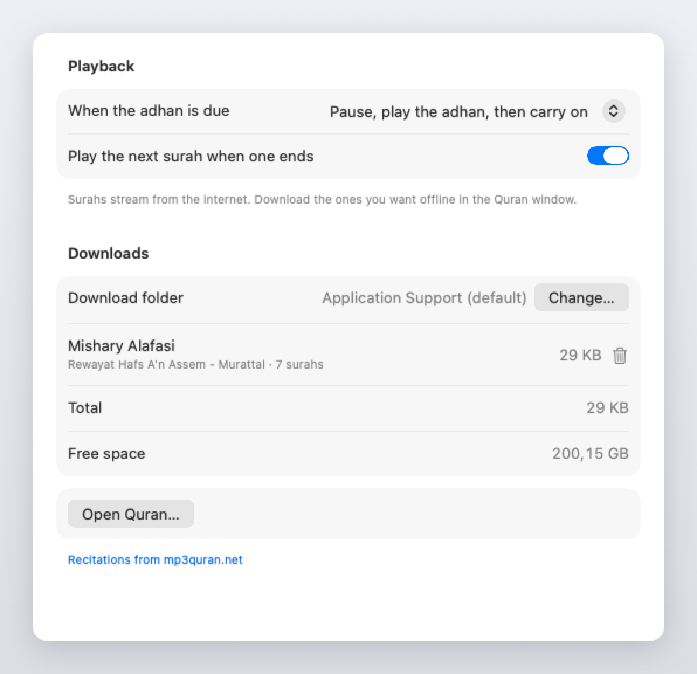 |

### The floating Mushaf

Press **📖** in the panel's Quran player (or **Mushaf** in the Quran window) to follow
the reading in a small window that stays above your other windows, even over
full-screen apps, without taking focus from what you're doing.

- It shows the **page of the Madani mushaf** (604 pages) being recited, in the Uthmani
  script, with each ayah's number in its ornament, and turns the page by itself.
- The **ayah being recited is highlighted** for the many reciters with ayah timings
  (Alafasy, Husary, Minshawi, Abdul Basit, Sudais…), and in Hifz mode; for the others
  it follows page by page.
- **Click an ayah** to listen from it. Turn pages with the arrows or the ← → keys;
  **Follow** brings it back to the recitation.
- Text size, **light, sepia or dark**, and see-through levels; it remembers its size
  and place. The daily wird's card opens it at today's pages.

Text: Tanzil (Uthmani). Font: Amiri Quran.

| Al-Baqarah, ayah 3 being recited | An-Naba', sepia, in Arabic |
|---|---|
| 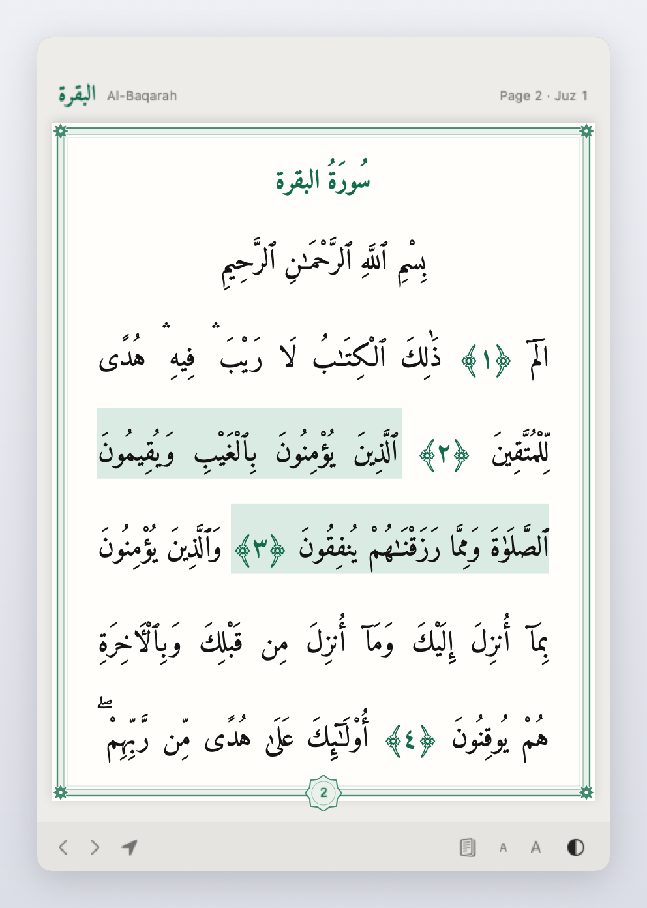 | 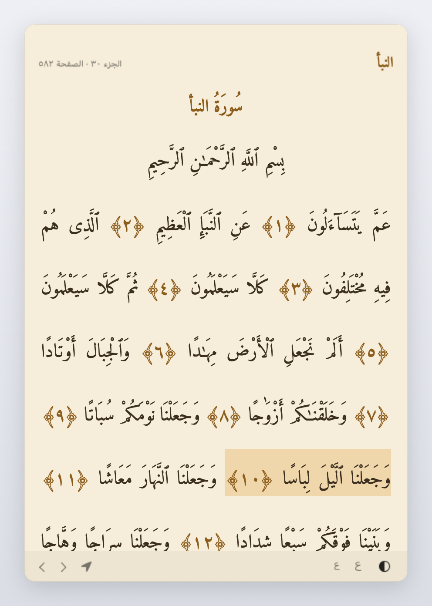 |

### Routines and the daily wird

**Settings → Routines** keeps you reading every day.

- **The daily wird**: a plan through the whole Quran, 1 to 40 pages a day (20 is a
  juz, a khatm a month), from wherever you start. The panel shows today's pages, for
  example *Pages 241–244 · Yusuf 44 → Yusuf 78*, with ▶ to listen from the first ayah
  and a check once read; tomorrow carries on from there. Settings shows how many
  days are left and your streak.
- **Routines**: what to play and when. Play the daily wird, carry on the Quran where
  you stopped, a surah (Al-Mulk after Isha, say), a dua chapter such as the morning
  and evening adhkar, or a Hifz review. Start it at a time, before or after a prayer
  (it moves with the prayer times), on the days you choose.
- At its time a routine **asks first** with a notification (**Play** or **Later**),
  or starts by itself with the sound fading in. It waits while you're in a call or a
  meeting and during the adhan, never cuts into something playing, and runs once a
  day.
- **Focus and Shortcuts**: add Salah Bar to a Focus (System Settings → Focus → Add
  Filter) to start a routine when that Focus turns on, or use **Run Routine** in
  Shortcuts, for example in an automation when your AirPods connect.

| Settings → Routines | The panel |
|---|---|
| 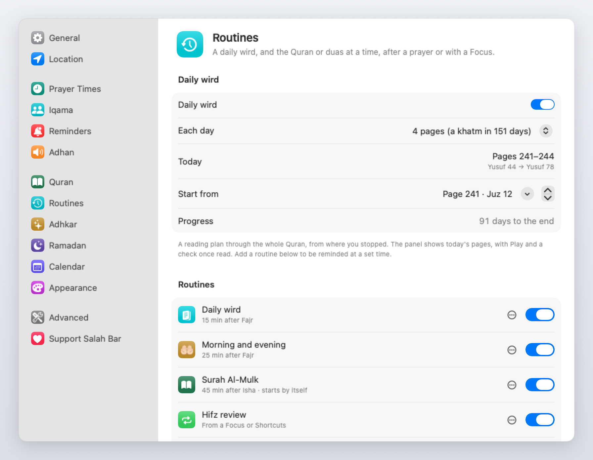 | 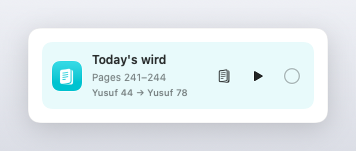 |

### Duas

**Duas…** in the panel opens the whole of *Hisn al-Muslim* (Fortress of the Muslim,
by Sa'id al-Qahtani): 267 duas in 132 chapters, grouped by topic (morning and evening,
sleep, prayer, travel, worry and hardship, illness, food and fasting, Hajj…) and
searchable, in Arabic too, with or without vowel marks.

- Each dua shows the Arabic, its meaning in your language, its number in the book and
  how many times to say it. Click **×3** (or ×33, ×100) to count as you say it.
- **▶** plays a dua's recording; **Play all** plays the chapter in order.
  **Repeat as said** plays each dua as many times as it's said (up to 10).
- The recordings stream from [hisnmuslim.com](https://www.hisnmuslim.com); **Offline**
  downloads all of them (about 120 MB) to listen without the internet.
- At prayer time a dua pauses for the adhan like the Quran does, and the Quran and the
  duas never play over each other.

| English | العربية |
|---|---|
| 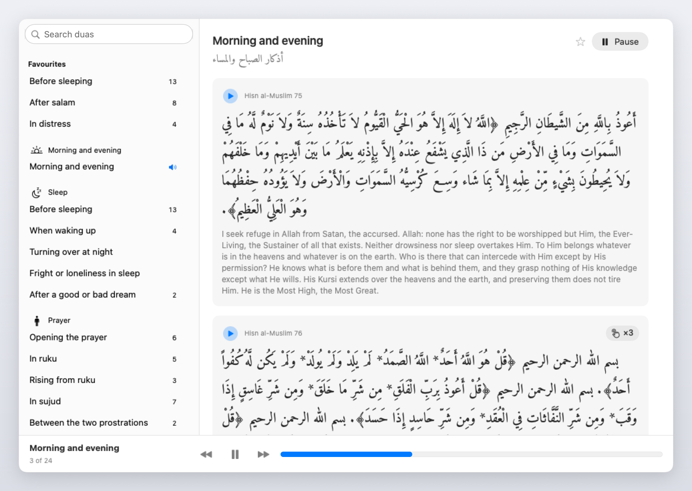 | 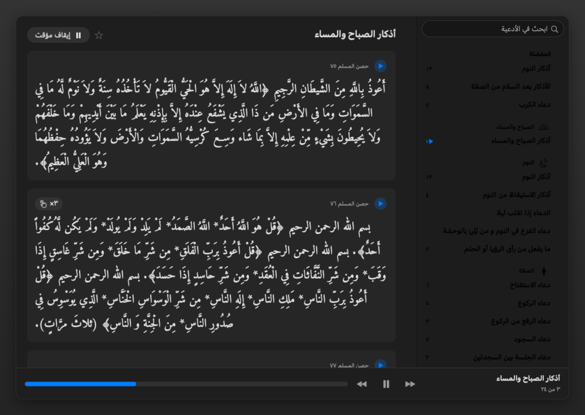 |

### More for every prayer

- **Iqama times** (Settings → Iqama): set each prayer's iqama as minutes
  after the adhan or a fixed time, plus a separate Jumu'ah time. The panel counts
  down to the iqama after each adhan, and can remind you before it.
- **Prayer log**: in the panel, click the circle next to a prayer once its time has
  begun (or press **Prayed ✓** on the prayer's notification). **Prayer Log…** shows
  your streak and the last 7 or 30 days. Turn on **Count missed prayers as qada** to
  keep a count of prayers to make up. Everything stays on your Mac.
  If you like, Salah Bar asks *"Did you pray Asr?"* when a prayer is still unmarked
  15 to 60 minutes after it begins, or shortly before the next prayer (Settings →
  Reminders, off by default); press **Prayed ✓** on that notification to mark it.
  Turn on **Track Sunnah prayers** there too for a second, smaller gold check beside
  Fajr, Dhuhr, Maghrib and Isha (and Asr, if you include the 4 before it) for their
  regular Sunnah, logged apart so your streak and qada stay as they are.
- **Calendar** (Settings → Calendar, off by default): Salah Bar warns you
  when a meeting overlaps a prayer, e.g. *"Your 13:00 meeting overlaps Dhuhr (13:04)"*,
  and can add short busy "Dhuhr", "Asr"… blocks to a calendar you choose. It only
  ever changes the blocks it made.
- **Friday and Sunnah reminders** (Settings → Reminders): on Fridays, a reminder
  to read Al-Kahf with a button to play it; optional reminders the evening before
  Monday, Thursday and White Days (13–15) fasts, and for the last third of the night.
- **The White Days** (Ayyām al-Bīḍ): from the day before the 13th to the 15th of each
  Hijri month, the panel shows the three moons with today's lit, and the hadith of
  Abu Dharr: *"If you fast three days of the month, fast the 13th, 14th and 15th"*
  (at-Tirmidhi 761). The fasting reminder quotes it too, and Monday and Thursday
  reminders quote the hadith about deeds being presented on those days.

  | English | العربية |
  |---|---|
  |  | 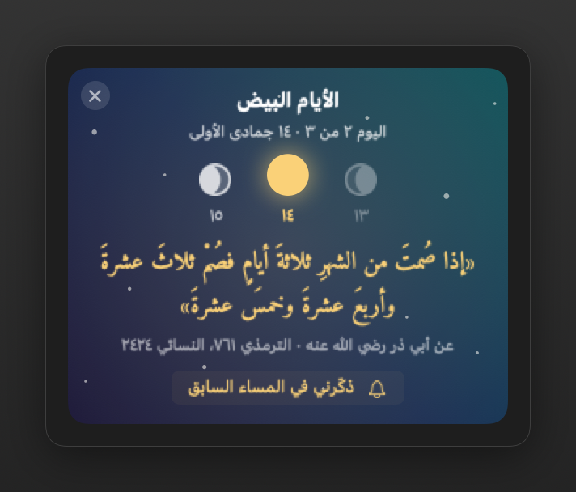 |

- **Pause other audio during the adhan**: music or a video in another app pauses
  while the adhan plays, then carries on.
- **Siri and Shortcuts**: ask *"When is Asr in Salah Bar"*, *"Next prayer in Salah
  Bar"* or *"Play Surah Al-Kahf in Salah Bar"*, or use the actions in Shortcuts.

### Dhikr cards

Turn on **Settings → Adhkar → Dhikr cards** and, now and then, a small card slides
in at the top of the screen with one dhikr or dua: the Arabic, its meaning and
its source (al-Bukhari, Muslim, Abu Dawud, at-Tirmidhi, Ibn Majah or the Quran),
with the number of times to say it where the hadith gives one. It makes no sound,
never takes focus, stays out of full-screen apps and fades after a minute (or
stays until you close it). **✓ Read** closes it and counts it for the day, and
**▶ Listen** plays its Hisn al-Muslim recording, where there is one.

- **When:** every 10 minutes to 12 hours between the hours you pick (9:00–21:00 by
  default), or at times you set. Never within 10 minutes of a prayer.
- **Morning and evening adhkar:** half an hour after Fajr and after Asr, one of the
  morning or evening adhkar, such as Sayyid al-Istighfar.
- **Not during meetings:** no card while a calendar event is on, in a call, with the
  camera or microphone in use, or with Focus on. It waits until you're free.

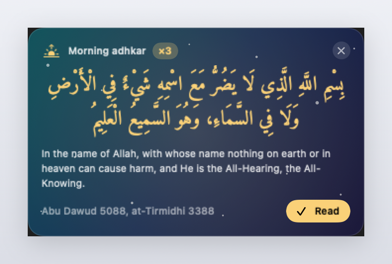

### Ramadan

From mid-Sha'ban the menu shows how many days are left until Ramadan (and any
fasts you still have to make up). During Ramadan, a card shows:

- **the day of Ramadan** and a dot for each day, gold for each day you fasted.
  Tick **Fasting today**, or **Not today** to add one to your fasts to make up;
  Salah Bar keeps that count all year (Settings → Ramadan).
- **the iftar dua** at Maghrib, *«ذهب الظمأ وابتلّت العروق وثبت الأجر إن شاء الله»*
  (Abu Dawud 2357), also with the Maghrib notification.
- on the **odd nights of the last ten**, Laylat al-Qadr with the dua
  *«اللهم إنك عفوٌّ تحب العفو فاعفُ عني»* (at-Tirmidhi 3513).
- with the **khatm plan** on, today's juz ("Juz 12: Hud 6 → Yusuf 52"): **▶** plays it
  from its first ayah with your reciter, **✓** marks it read, and it tells you if you're behind.
  Finish the Quran once, twice or three times.
- from the 27th, a reminder to give **Zakat al-Fitr** before the Eid prayer; on Eid,
  *«تقبّل الله منّا ومنكم»*; then the **six days of Shawwal** with a counter.

Optional reminders: **suhoor** before Imsak, **Taraweeh** after Isha, **Laylat
al-Qadr** at the start of the last third of the odd nights, and **Zakat al-Fitr** on
the 27th. **Wake the Mac for suhoor** asks once for your password and schedules a
wake before each suhoor reminder of the month, so you hear it even if the Mac was
asleep (not in the App Store version). With prayer blocks on (Settings → Calendar),
**Iftar and Taraweeh in my calendar** stretches the Maghrib block over iftar and the
Isha block over Taraweeh. The **Ramadan widget** (Small or Medium) shows the day, a
live countdown to iftar (or to the end of suhoor), your fasts and today's juz;
outside Ramadan it counts the days until it. **Iftar in the menu bar**
counts down to iftar while you fast, instead of to the next prayer. Siri: *"When is
iftar in Salah Bar"*, *"When does suhoor end in Salah Bar"*. All of it is optional,
in **Settings → Ramadan**, which also has the Hijri adjustment for when Ramadan
starts a day earlier or later where you live.

| The 27th night | Iftar, in Arabic |
|---|---|
| 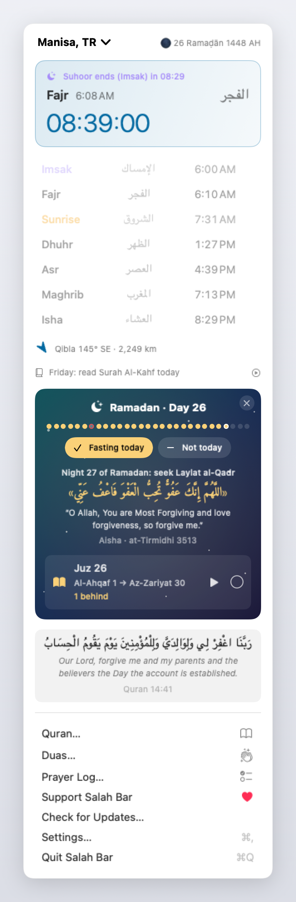 | 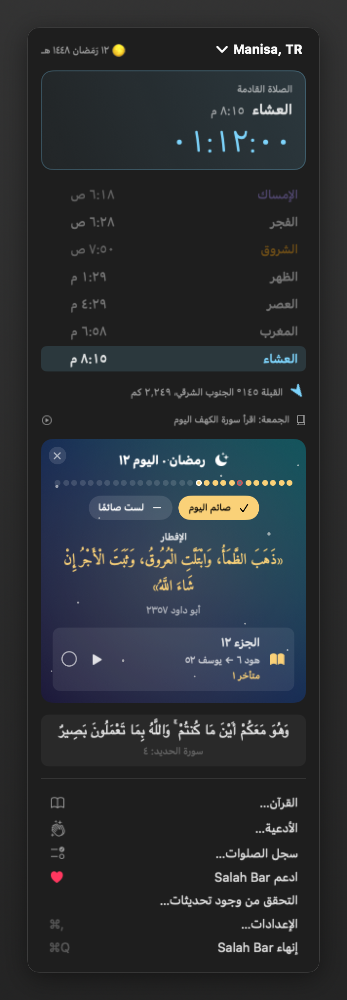 |
| **The Ramadan widget** | |
| 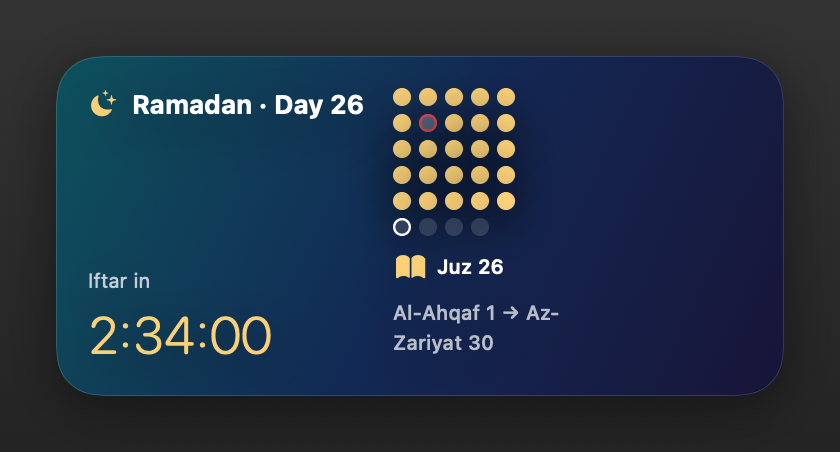 | 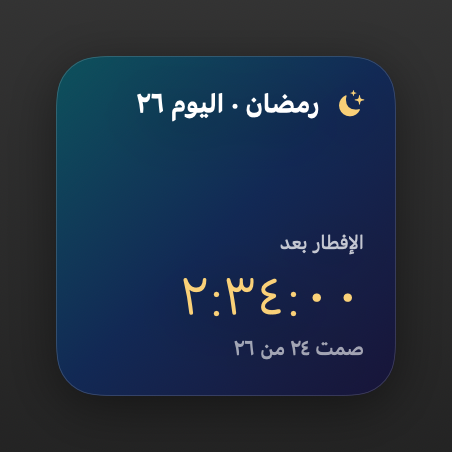 |

### Desktop widgets

Right-click the desktop → **Edit Widgets…** → search **Salah Bar**.

| Size | Shows |
|---|---|
| **Small** | The next prayer, its time and a live countdown, and the city |
| **Medium** | All of that, plus today's times and the Hijri date |
| **Large** | All of that, plus the Qibla and the rotating ayah or dua |

| Medium | Large, as a prayer begins |
|---|---|
| 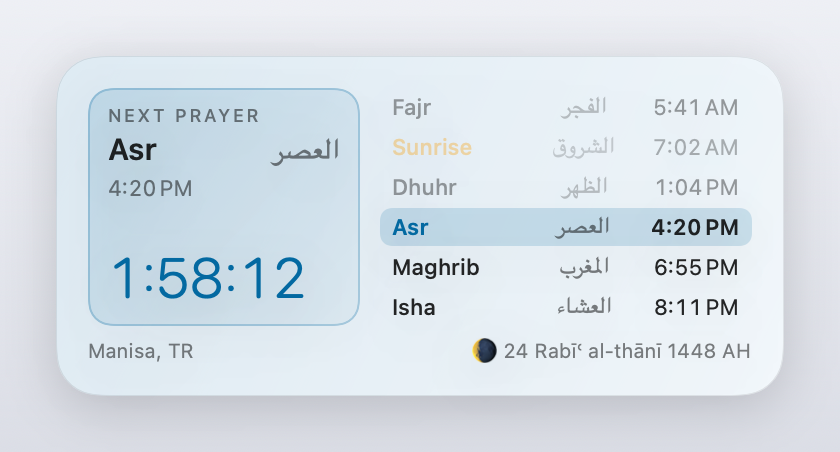 | 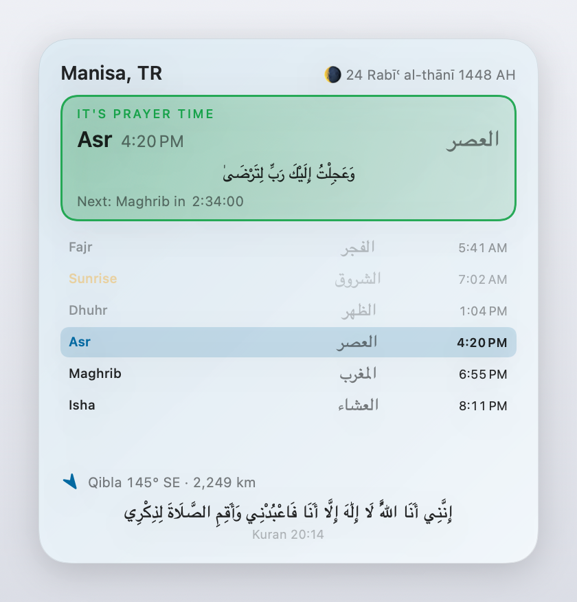 |

The widgets turn green during the flash warning, and show a **Stop Adhan**
button while the adhan plays. For two minutes after each prayer begins, the
Large widget says **It's prayer time** with that prayer and the ayah
*وَعَجِلْتُ إِلَيْكَ رَبِّ لِتَرْضَىٰ*, then goes back to counting down to the next prayer.

### Choosing your adhan

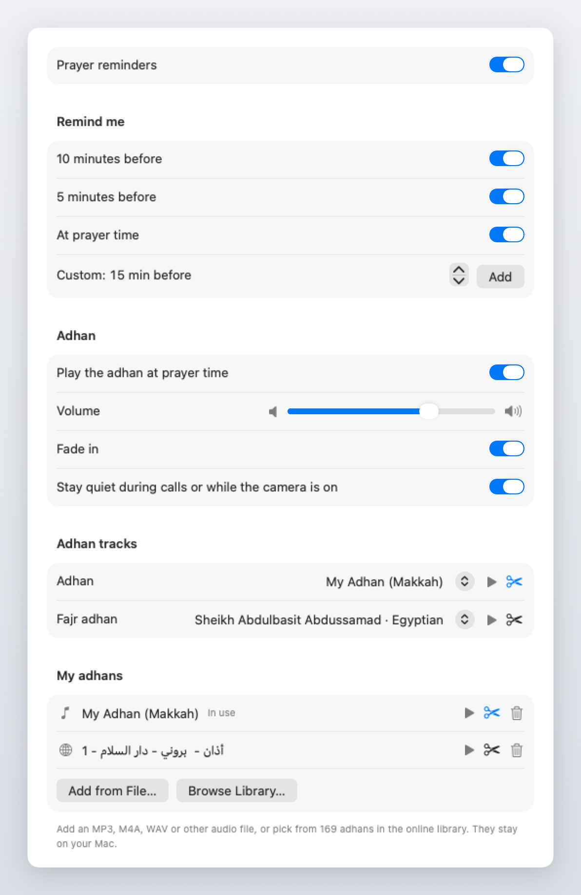

In **Settings → Adhan** pick the adhan for the five prayers and,
optionally, a different one for Fajr. Press ▶ to hear it.

- **Built in:** 17 adhans from Makkah, Madinah, Egypt, Qatar, Morocco and more, including 6 openly licensed recordings from Wikimedia Commons and Freesound (credited under the picker and in [THIRD_PARTY_NOTICES.md](THIRD_PARTY_NOTICES.md)).
- **Your own recording:** under **My adhans**, choose **Add from File…** and pick
  any MP3, M4A, WAV or other audio file. Name it, then use it for the adhan or
  for Fajr. Salah Bar keeps its own copy, so moving or deleting the original is fine.
- **The online library:** choose **Browse Library…** to search and preview
  169 adhans from around the world, and **Add** the ones you like. Each one is
  downloaded once and then works offline.

| Adhan library | Trimming an adhan |
|---|---|
| 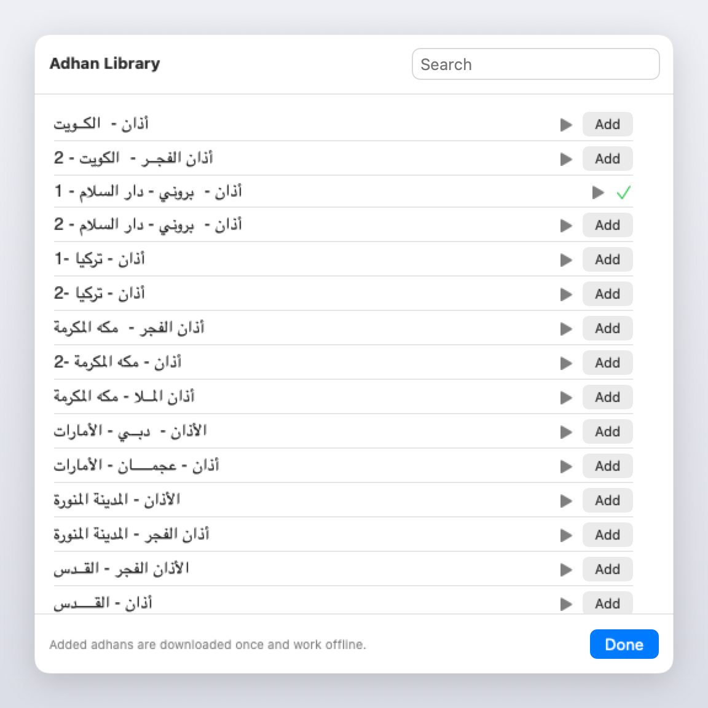 | 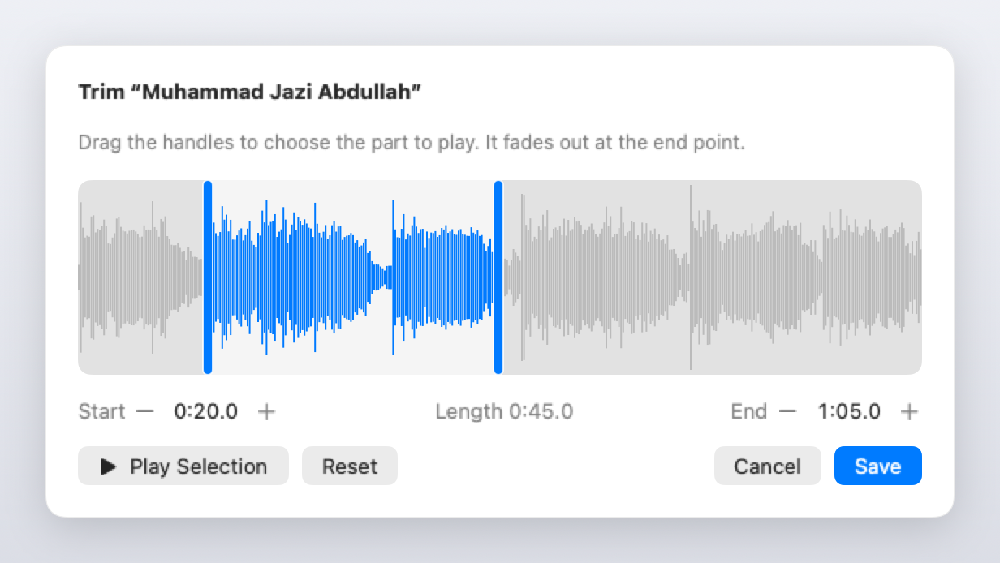 |

### Trimming the adhan

Long recording, or you only like a part of it? Click **✂︎** next to the Adhan
or Fajr picker, or on a row under **My adhans**:

1. Drag the **start** and **end** handles on the waveform.
2. Fine-tune with **−** / **+** (half a second each).
3. Press **▶ Play Selection** to listen, then **Save**.

At prayer time the adhan starts at your start point and fades out gently at
your end point. The ✂︎ turns blue for trimmed recordings; **Reset** plays the
whole recording again.

### The flash before the adhan

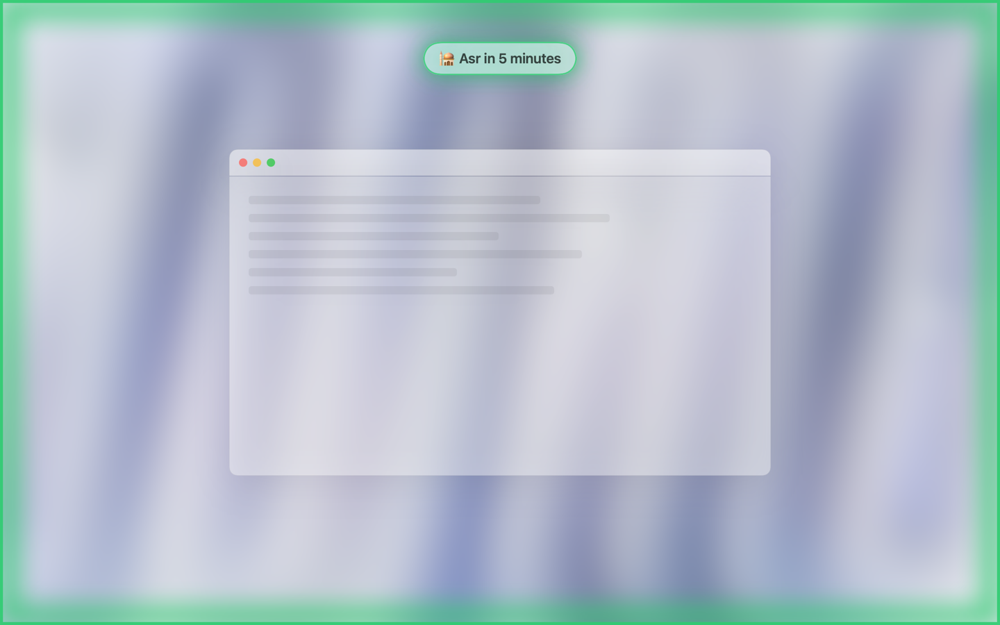

A few minutes before each adhan (5 by default), Salah Bar makes sure you notice:

- A soft **green glow pulses around the edges of your screens**, with a banner
  like **"🕌 Asr in 5 minutes"**, then fades after a few seconds. It never takes
  your clicks or keyboard, shows over full-screen apps, and stays off during
  calls, camera use and Focus.
- The **menu bar icon blinks** 🔔 / 🟢 until the adhan, and the countdown turns green.
  To stop it for this prayer, press **Stop Flashing** in the panel, or click the
  reminder notification (or its **Silence** button). The reminders and the adhan still come.

Change the minutes, turn either part off, or try it with **Preview** in
**Settings → Appearance → Flash warning**.

### Stopping the adhan

Any of these stops it:

- the **Silence** button on the prayer notification, or clicking the notification
- **Stop Adhan** in the menu panel
- the stop button on the desktop widget
- closing the lid or putting the Mac to sleep (the adhan won't pick up again when it wakes)

Only one copy of Salah Bar runs at a time, so you never hear the adhan twice:
if you open a second copy (say, from the disk image while the installed one
is running), it quits by itself.

### Staying quiet during calls

With **Settings → Adhan → Stay quiet during calls or while the camera
is on**, Salah Bar doesn't play the adhan while your microphone or camera is in
use. You still get the notification, and the panel tells you why the adhan was
muted.

Salah Bar can also stay quiet while a **Focus** mode is on. macOS only lets it
see your Focus with **Full Disk Access**, so this is opt-in: add Salah Bar under
**System Settings → Privacy & Security → Full Disk Access**. Without it, Focus is
simply ignored.

### Location

By default, Salah Bar follows your Mac's location and updates it when you move.
Only Apple's location services are used. Salah Bar never guesses your location
from your IP address, because that is often wrong by a whole city.

If you'd rather not share your location, or you want times for somewhere else,
search for a city under **Settings → Location** and save it. You can switch
between saved cities from the menu panel.

### Launch at login

Turn on **Settings → General → Launch at login**. This works once Salah Bar is
in your **Applications** folder.

---

## Updates

Salah Bar checks for updates automatically and offers to install them. To check
yourself, choose **Check for Updates…** in the menu panel. Updates don't trigger
the first-launch warning again.

---

## Upgrading from the old SwiftBar/Übersicht version

Earlier versions of salah-bar were a SwiftBar plugin and an Übersicht widget,
set up by the old `install.sh`. Salah Bar replaces both.

**Your settings come with you.** The first time Salah Bar opens, it imports your
settings from `~/.config/salah-bar/config.json`: method, school, adjustments,
notifications, adhan tracks, saved cities and so on. Your saved cities appear in
the city switcher, and automatic location is selected to start with. The old
files aren't changed.

> [!WARNING]
> Remove the old version once Salah Bar is running. If both run at the same
> time, you get every adhan and notification twice.

A **Remove old version** button in **Settings → Advanced** is coming in the next
release. Until then, you can remove the old version in one of two ways.

**The quick way.** Run the installer with `--uninstall`. It removes only the
old version and keeps your `config.json` (add `--purge` to delete it too). If
you have other SwiftBar plugins or Übersicht widgets, SwiftBar and Übersicht
keep running and starting at login.

```bash
curl -fsSL https://raw.githubusercontent.com/be-liever95/salah-bar/main/install.sh | bash -s -- --uninstall
```

**By hand.** Paste these lines into Terminal:

```bash
# 1. Stop the old login items from starting SwiftBar and Übersicht
for agent in com.salah-bar.launch-swiftbar com.salah-bar.launch-ubersicht; do
  launchctl bootout gui/$(id -u) ~/Library/LaunchAgents/$agent.plist 2>/dev/null
  rm -f ~/Library/LaunchAgents/$agent.plist
done

# 2. Stop an old adhan that may still be playing
pkill -f adhan_fade.js

# 3. Remove the SwiftBar plugin and the Übersicht widget
rm -f ~/.config/salah-bar/plugins/prayertimes.30s.sh
rm -rf ~/Library/Application\ Support/Übersicht/widgets/prayertimes.widget

# 4. Remove the old program files (your config.json stays)
rm -rf ~/.config/salah-bar/app

# 5. Quit SwiftBar and Übersicht
osascript -e 'quit app "SwiftBar"' -e 'quit app "Übersicht"'
```

If you pointed SwiftBar at a different plugins folder, remove
`prayertimes.30s.py` (or `prayertimes.30s.sh`) from that folder instead.

**SwiftBar, Übersicht and the Homebrew extras** are left installed in both
cases. If you don't use them for anything else, you can remove them too:

```bash
brew uninstall --cask swiftbar ubersicht
brew uninstall corelocationcli terminal-notifier
```

If you installed SwiftBar or Übersicht without Homebrew, drag them from
Applications to the Trash instead.

---

## Uninstall

1. Quit Salah Bar (menu panel → **Quit Salah Bar**).
2. Drag **Salah Bar** from Applications to the Trash.

Or remove the app, its data and its settings in one line:

```bash
curl -fsSL https://raw.githubusercontent.com/be-liever95/salah-bar/main/install.sh | bash -s -- --uninstall-app
```

To remove its data and settings by hand instead:

```bash
rm -rf ~/Library/Application\ Support/Salah\ Bar ~/Library/Logs/Salah\ Bar
defaults delete io.github.abdalmoamen95.salahbar
```

The **Salah Bar Self-Signed** certificate only exists if you built Salah Bar
from source on that Mac. To remove it, open **Keychain Access**, search for it
in the login keychain, and delete it.

---

## Prayer times accuracy

Salah Bar calculates prayer times on your Mac. It doesn't download them.

- **Diyanet (method 13, the default)** matches the official tables at
  [namazvakitleri.diyanet.gov.tr](https://namazvakitleri.diyanet.gov.tr) to the
  minute on 90–99% of days, and is never more than 1 minute off. This was
  checked over 7 cities × 396 days.
- **ISNA, Muslim World League and Umm al-Qura** match
  [Aladhan](https://aladhan.com) within 1 minute. Other methods use the same
  calculation, but haven't been checked against official tables yet, so they
  are marked *(approx.)* in Settings.
- **Adjustments** in **Settings → Prayer Times** are added on top of the
  method's own built-in adjustments. For example, Diyanet already moves Dhuhr
  by +5 minutes, so +1 there gives +6 in total.

The checks run as unit tests on every build, against the published Diyanet
tables and the Aladhan API.

## About the ayahs and duas

The panel and the Large widget show one of 42 quotes: 18 ayahs and hadiths
carried over from the original widget, plus 15 duas and 9 ayahs from the Quran.
The Quranic Arabic of the added ones is copied word for word from the
[Tanzil](https://tanzil.net) text (via [alquran.cloud](https://alquran.cloud)),
never typed by hand. Translations are Sahih International (English) and the
Diyanet meal (Turkish). A script regenerates them from the source.

---

## Source code

Salah Bar's source code is private, and the app is "all rights reserved"
(see [LICENSE](LICENSE)). This repository holds the downloads, the update
feed and the installer.

The one exception is the prayer-time engine of versions 2.0.0 to 2.7.3,
[`third-party/SolarModel-2.0-2.7.3.swift`](third-party/SolarModel-2.0-2.7.3.swift),
published here under the LGPL-3.0 as its licence requires (see
[THIRD_PARTY_NOTICES.md](THIRD_PARTY_NOTICES.md)). Later versions don't use it.

---

## Support Salah Bar

Salah Bar is free and has no ads. If it helps you keep your
prayers, you can support its development. The **♥ Support Salah Bar** button in
the menu panel and in **Settings → Support Salah Bar** takes you straight there.

- ☕ **[Buy Me a Coffee](https://buymeacoffee.com/be_liever95)**: a one-time or monthly gift by card or Apple Pay, no account needed
- 💖 **[Sponsor on GitHub](https://github.com/sponsors/be-liever95)**: if you have a GitHub account
- ⭐ **Star the project** on GitHub so more people find it.
- 📣 **Tell a friend** or share it at your mosque.
- 🐞 **Report a problem or suggest a feature** in [Issues](https://github.com/be-liever95/salah-bar/issues).

## License

Copyright © 2026 Mumin Muhammedoglu. **All rights reserved.** Salah Bar may
not be copied, modified or redistributed without permission. You're welcome to
download and use the official releases on your own Macs, free of charge. See
[LICENSE](LICENSE).

Third-party parts keep their own licenses (Sparkle: MIT; in versions 2.0.0 to
2.7.3, a prayer-time engine ported from PrayTimes.js: LGPL-3.0); see
[THIRD_PARTY_NOTICES.md](THIRD_PARTY_NOTICES.md). Versions up to v2.5.0 were
published under the MIT License.
